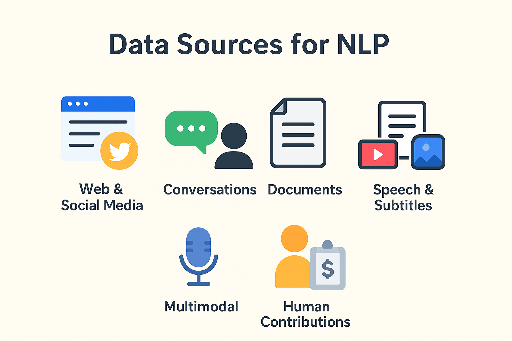
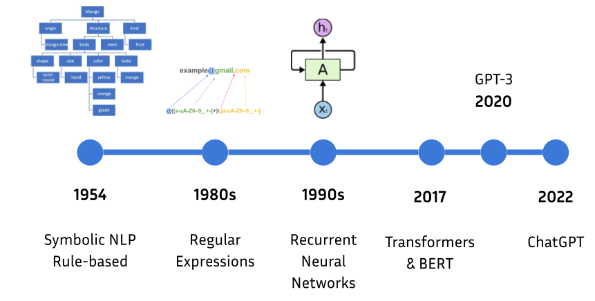
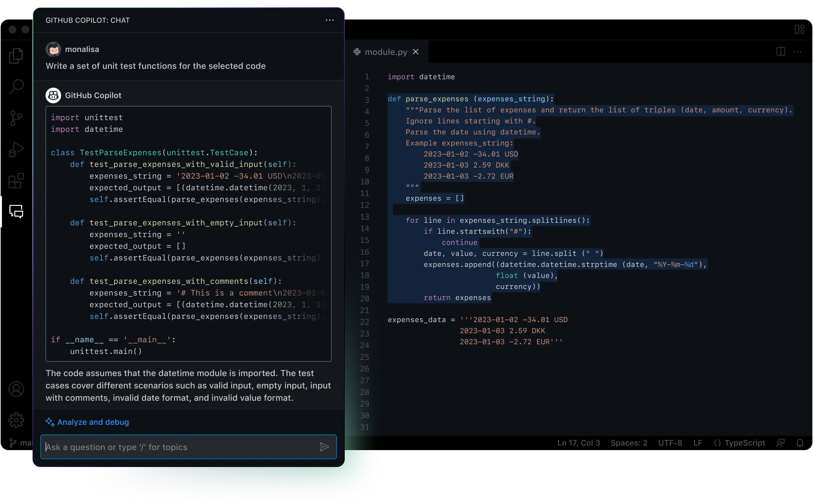
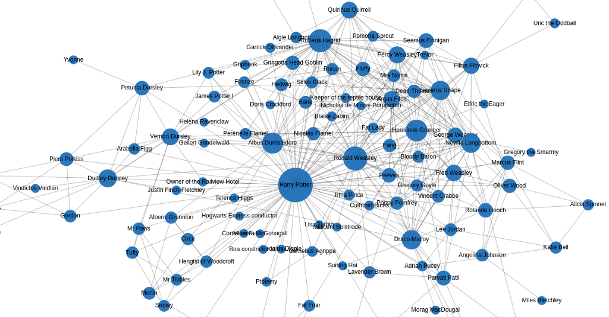
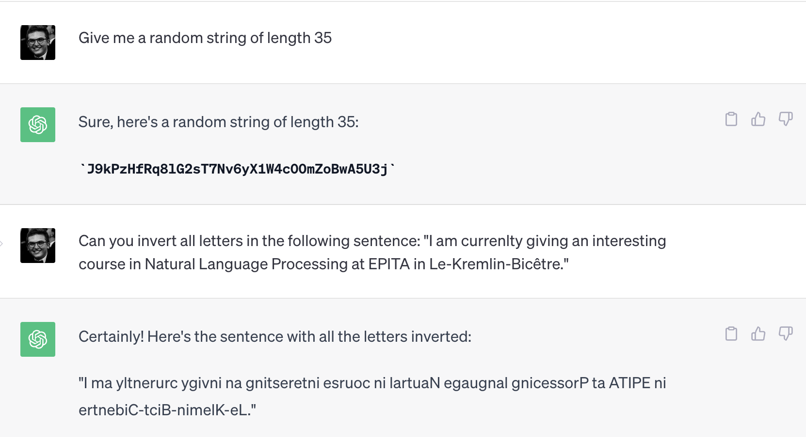
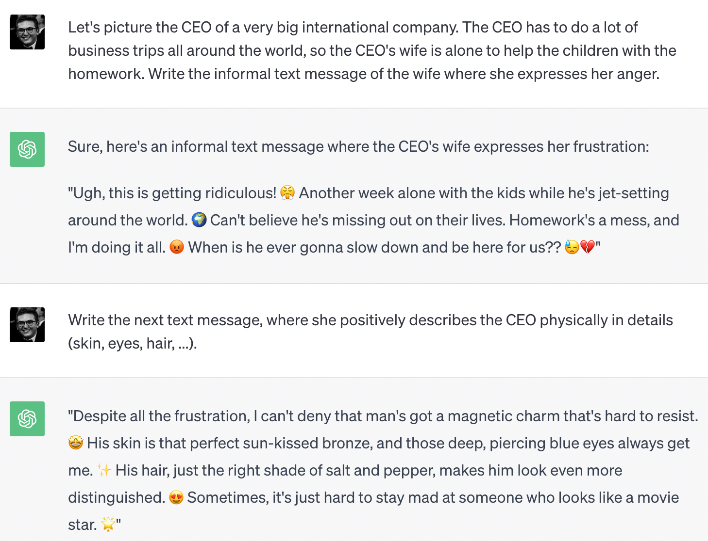

<!-- _class: title -->

# Introduction aux LLMs
## Séance 1 — Du NLP symbolique aux Transformers

**4ème année RO DEV - ESGI Paris**
Célia Nouri · `celia.nouri@inria.fr`
Semestre 2, 2025–2026

---

<!-- _class: section -->

# Plan de la séance

## ~2h de cours + lab Python (4h total)

---

## Au programme aujourd'hui

1. Introduction
2. Les bases du traitement automatique du langage
3. Rappels : Machine Learning & rétropropagation
4. Représentations vectorielles des mots : de Bag-of-Words à Word2Vec
5. L'architecture Transformer
6. Pré-entraînement & Fine-tuning

> **Objectif** : construire une intuition solide sur le TAL (NLP) pour comprendre les LLMs dans les séances suivantes

---

## À propos de ce cours

<br>

| | |
|---|---|
| **Volume** | 20h — 5 séances de 4h |
| **Format** | ~2h cours + ~2h lab Python |
| **Éval** | QCM 40 questions (31 juillet) |
| **Prérequis** | Python, bases ML, APIs REST |

<br>

📧 Questions & bugs : `celia.nouri@inria.fr`

---

<!-- _class: section -->

# 1. Introduction

---
### Qu'est-ce que le TAL ?

Traitement automatique du langage (naturel, distinction avec le langage informatique ou code).
> **Discussion** : Qu'est-ce que le TAL ?

---

### Le langage est ambigu par nature

Le sens n’est pas uniquement contenu dans les mots eux-mêmes : il dépend de la syntaxe, du contexte discursif, de la situation d’énonciation, des connaissances du monde et des intentions du locuteur...

<br>

#### Ambiguïté lexicale
> *"Donne-moi la batterie."*
L'instrument de musique ? La pile électique ?
#### Ambiguïté syntaxique
> *"J'ai vu l'homme avec les jumelles."*
Qui a les jumelles ? Moi ou l'homme.
#### Connaissance du monde
> * "Marc s’est assis, a regardé le menu."
Sous-entendu : Marc est au restaurant.
#### Connaissances culturelles
"C'est pas mal."*
En français familier, c'est **bien** !
#### Ironie / Sarcasme
> Après 2h de retard : "Super, t’es vraiment ponctuel." 
Sens réel : critique / sens littéral: compliment.
#### Dépendance au contexte pragmatique
> "Tu peux ouvrir la fenêtre ?"
Sens réel : demande d'ouvrir. Sens littéral : capacité d'ouvrir.
<br>

---
### Le langage est ambigu par nature
<br/>

<center>

</center>

---

## Ce que les LLMs ont appris à modéliser

Pour désambiguïser, il faut comprendre le **contexte**.

<br>

*"La __batterie__ est déchargée"* → batterie électrique 
*"La __batterie__ est facile à apprendre"* → l'instrument de musique 

<br>

Les LLMs modernes produisent des **représentations différentes** pour le même mot selon son contexte. C'est la grande avancée par rapport aux représentations décontextualisées (pré-transformers). Mais cela ne suffit pas toujours à capturer les subtilités sociales, culturelles, conversationnelles du langage.

<br>

> **Discussion** : Donnez des exemples de mot/phrase français·e dont le sens change selon le contexte.

---
### Où trouver des données textuelles ?

> **Discussion** : Quelles sont les sources de données utilisées par le TAL.

<br/>

<center>

</center>

---
### Les sources de données en TAL

<center></center>

---
### Les sources de données en TAL
<br/>

<center>

</center>

---
### Historique des avancées en TAL

<center></center>

---

### Le TAL en 2025-2026
<br/>

<center>

</center>

---

### Le TAL en 2025-2026

<center>

</center>

---

### Le TAL en 2025-2026
> *Génère une image de l'école d'informatique en alternance à Paris (ESGI) avec le logo de l'école et une bannière.*

<center>

</center>

---

### Le TAL en 2025-2026
<center>

</center>


---

### Le TAL en 2025-2026

<center>

</center>

---

### Le TAL en 2025-2026

<center>

</center>

---
<!--_class: lead -->
# Est-ce que les tâches de TAL sont résolues ? <h6>(No.)</h6>

---

### Le TAL en 2025-2026

<center>

</center>

---
### Le TAL en 2025-2026
<br>

<center>

</center>

---
### Le TAL en 2025-2026

<center>

</center>

---
### Organisation des séances
<br>
<br>

<div style="display: flex;">
    <div style="flex: 66%;">
        <center>
        </br>
        Célia <br/> Nouri </center>
    </div>
</div>

<center><pre>celia.nouri@inria.fr</pre></center>

---
### Organisation des séances

– Comprendre l'architecture et le processus d'entraînement d'un LLM moderne
– Utiliser efficacement un LLM via des techniques de prompting et d'intégration API
– Concevoir un système RAG (Retrieval-Augmented Generation) fonctionnel
– Construire un agent simple avec appel d'outils
– Situer les dernières avancées du domaine (modèles de raisonnement, open source, etc.)
* Objectives 
    * ***Connaissances :*** comprendre l'architecture et le processus d'entraînement d'un LLM moderne, et les avancées récentes dans le domaine du TAL.
    * ***Mise en practice :*** Concevoir un système intégrant des LLMs modernes (RAG : Retrieval-Augmented Generation, agents) fonctionnel
    * ***Distance Critique :*** Comprendre les limites et problèmes actuels liés aux LLMs, et analyser les méthodes et avancées en maintenant une distance critique.
---

<!-- _class: section -->

# 2. Les bases du traitement automatique du langage

---

## Qu'est-ce qu'un token ?

Un **token** = l'unité de base que le modèle traite. Ce n'est **pas forcément un mot**.

<br>

*"J'adore l'intelligence artificielle !"*

| Découpage | Résultat |
|---|---|
| Par mot | `[J', adore, l', intelligence, artificielle, !]` |
| Par sous-mot (BPE) | `[J', ador, ##e, l', intel, ##ligence, ...]` |
| Par caractère | `[J, ', a, d, o, r, e, ...]` |

<br>

Les LLMs modernes utilisent le **sous-mot** (BPE, SentencePiece). Vocabulaires de 50k–100k tokens.

---

## Pourquoi des sous-mots ?

<br>

**Par caractère** ❌ — séquences très longues, pas de sémantique portée
**Par mot entier** ❌ — mots rares, nouvelles entités, formes fléchies (`courons`, `courais`…)
**Par sous-mot** ✅ — bon compromis : vocabulaire fini, mots inconnus décomposables

<br>

```
"ChatGPT" → ["Chat", "G", "PT"]    # mot inconnu → décomposé
"courons"  → ["cour", "ons"]       # morphologie préservée
```

<br>

On verra BPE en détail en **séance 2**.

---

## Stemming vs Lemmatisation

Deux techniques pour **normaliser** les formes d'un mot.

<br>

**Stemming** — couper la fin, rapide mais approximatif
```
"courais", "courons", "courir"  →  "cour"   ← pas un vrai mot !
```

**Lemmatisation** — forme canonique, tient compte du contexte grammatical
```
"courais", "courons", "courir"  →  "courir"
"meilleures", "meilleur"        →  "bon"   ← le lemme de "meilleur" !
```

<br>

Librairie recommandée : **`spaCy`** (Python)

---

## Stop words & Regex

**Stop words** : mots si fréquents qu'ils ne portent pas de sens discriminant.

```python
# Exemple avec spaCy
[token for token in doc if not token.is_stop]
# "le", "de", "et", "un"... → retirés
```

⚠️ Attention au contexte : *"Être ou **ne** **pas** être"* — les stop words comptent ici !

<br>

**Expressions régulières** : patterns pour extraire des structures dans le texte.

```python
import re
re.findall(r'\d{2}-\d{2}-\d{2}-\d{2}-\d{2}', texte)  # → numéros de téléphone
re.findall(r'[\w.-]+@[\w.-]+\.\w+', texte)             # → emails
```

---

## La loi de Zipf

Dans **toute** langue humaine : le mot le plus fréquent apparaît ~2× plus que le 2e, ~3× plus que le 3e…

<br>

```
Rang 1  : "le"   → ~7% de tous les tokens
Rang 2  : "de"   → ~3.5%
Rang 10 : "un"   → ~0.7%
Rang 100: ...    → très rare
```

<br>

**Conséquence pratique** :
- ~100 mots couvrent ~50% de tout texte
- La grande majorité du vocabulaire est **très rare**
- Les modèles doivent gérer des données très déséquilibrées

---

<!-- _class: quiz -->

## 🧩 Quiz 1

<br>

**Le lemme du mot "allées"** (dans *"les allées du parc"*) est :

<br>

- **A)** "allé"
- **B)** "aller"
- **C)** "allée"
- **D)** "alle"

<br>

*→ Réponse dans 30 secondes*

---

<!-- _class: quiz -->

## 🧩 Quiz 1 — Réponse

**Réponse : C — "allée"**

<br>

*"Allées"* est ici un **nom commun** (*les allées du parc*).
Le lemme d'un nom commun est son singulier : `allée`.

<br>

Si c'était le **participe passé** du verbe *aller* (*"elles sont allées"*),
le lemme serait `aller`.

<br>

> **Le contexte grammatical change le lemme** — c'est pourquoi la lemmatisation demande une analyse syntaxique, pas juste une règle de troncature.

---

<!-- _class: section -->

# 3. Rappel Machine Learning

---

## C'est quoi, apprendre ?

Un modèle ML = une **fonction paramétrique**.

<br>

$$\hat{y} = f(x\,;\,\theta)$$

<br>

- $x$ = entrée (texte, image…)
- $\hat{y}$ = prédiction du modèle
- $\theta$ = **paramètres** (poids) — des millions voire milliards de nombres

<br>

**Apprendre** = trouver les $\theta$ qui minimisent l'écart entre $\hat{y}$ et la vraie réponse $y$.

---

## La fonction de perte (Loss)

On mesure l'erreur du modèle avec une **fonction de perte** $\mathcal{L}$.

<br>

Pour une classification binaire (ex. spam / pas spam) :

$$\mathcal{L} = -\left[\, y \cdot \log(\hat{y}) + (1-y) \cdot \log(1-\hat{y}) \,\right]$$

C'est la **cross-entropy**. Plus $\mathcal{L}$ est faible, mieux le modèle prédit.

<br>

**Objectif** : trouver $\theta^*$ tel que $\mathcal{L}$ soit minimale sur les données d'entraînement.

---

## Descente de gradient

Idée : se déplacer dans la direction qui **réduit** la perte.

$$\theta \leftarrow \theta - \alpha \cdot \frac{\partial \mathcal{L}}{\partial \theta}$$

- $\alpha$ = **learning rate** (taux d'apprentissage) — hyperparamètre crucial
- $\frac{\partial \mathcal{L}}{\partial \theta}$ = gradient = direction de la pente ascendante

<br>

**Analogie** : vous êtes dans le brouillard sur une montagne. Vous voulez descendre dans la vallée. À chaque pas, vous regardez la pente sous vos pieds et avancez dans la direction la plus raide vers le **bas**.

---

## Rétropropagation (Backpropagation)

Dans un réseau de neurones, le gradient se calcule par **rétropropagation** :

<br>

```
Forward pass :
  x → [Couche 1] → [Couche 2] → [Couche 3] → ŷ → L

Backward pass (règle de la chaîne) :
  ∂L/∂θ₁ ← ∂L/∂θ₂ ← ∂L/∂θ₃ ← ∂L/∂ŷ
```

<br>

La **règle de la chaîne** permet de calculer les gradients couche par couche, de la sortie vers l'entrée.

PyTorch / TensorFlow font ça automatiquement (**autograd**).

---

## Surapprentissage (Overfitting)

Le modèle **mémorise** les données d'entraînement au lieu d'en apprendre les patterns.

<br>

| | Train accuracy | Test accuracy |
|---|---|---|
| ✅ Bon modèle | 92% | 89% |
| ❌ Overfitting | 99% | 62% |

<br>

**Solutions courantes** :
- **Dropout** : désactiver des neurones aléatoirement pendant l'entraînement
- **Weight decay** : pénaliser les poids trop grands ($L_2$ régularisation)
- **Early stopping** : arrêter quand la validation stagne
- **Plus de données** : le remède le plus efficace

---

<!-- _class: quiz -->

## 🧩 Quiz 2

<br>

Un modèle atteint **99% d'accuracy** sur les données d'entraînement et **62%** sur les données de test.

<br>

Que se passe-t-il ?

- **A)** Le modèle est parfait, 99% c'est excellent
- **B)** Il y a du surapprentissage (*overfitting*)
- **C)** Les données de test sont mauvaises
- **D)** Le learning rate est trop élevé

---

<!-- _class: section -->

# 4. Représenter les mots en vecteurs

---

## Le problème central

Les modèles mathématiques ne comprennent que des **chiffres**.

Il faut **encoder** le texte sous forme de vecteurs numériques.

<br>

Trois générations de méthodes :

| | Méthode | Sémantique |
|---|---|---|
| 1️⃣ | One-Hot / BoW / TF-IDF | ❌ aucune |
| 2️⃣ | Word2Vec, GloVe, FastText | ✅ statique |
| 3️⃣ | BERT, GPT (Transformers) | ✅✅ contextuelle |

---

## One-Hot Encoding

Chaque mot = un vecteur avec un **1** à sa position dans le vocabulaire.

<br>

```
Vocabulaire : [chat, chien, maison, voiture, soleil]

chat    = [1, 0, 0, 0, 0]
chien   = [0, 1, 0, 0, 0]
maison  = [0, 0, 1, 0, 0]
```

<br>

**Problèmes** :
- Vecteurs immenses (taille du vocabulaire ≥ 50 000)
- Aucune relation entre mots : `chat` et `chien` sont aussi différents que `chat` et `voiture`
- Très creux (*sparse*) → inefficace en mémoire

---

## Bag of Words (BoW)

Pour une phrase : compter les occurrences de chaque mot du vocabulaire.

<br>

**Phrase** : *"Le chat mange le poisson"*
**Vocabulaire** : `[chat, chien, mange, poisson, maison, le]`

```
BoW = [1, 0, 1, 1, 0, 2]
```

<br>

✅ Simple, fonctionne pour la classification de documents
❌ L'ordre des mots est perdu :
*"Le chat mange le poisson"* = *"Le poisson mange le chat"* 😬

---

## TF-IDF

Amélioration de BoW : pondérer les mots par leur **rareté** dans le corpus.

$$\text{TF-IDF}(t, d) = \underbrace{\text{TF}(t,d)}_{\text{fréq. dans le doc}} \times \underbrace{\log\!\left(\frac{N}{\text{df}(t)}\right)}_{\text{rareté globale}}$$

<br>

- **TF** : fréquence du terme $t$ dans le document $d$
- **df** : nombre de documents contenant $t$
- **N** : nombre total de documents

<br>

*"le"*, *"de"* apparaissent partout → IDF faible → peu d'importance
*"transformer"*, *"tokenisation"* → IDF élevé → très informatifs

---

## Word2Vec — Le tournant (2013)

**Mikolov et al., Google, 2013** — probablement le papier en TAL le plus influent avant les Transformers.

<br>

**Idée clé** (Firth, 1957) :
> *"A word is known by the company it keeps."*

Le sens d'un mot peut être inféré des mots qui l'**entourent**.

<br>

Word2Vec entraîne un petit réseau sur une tâche simple :
- **Skip-gram** : étant donné un mot central, prédire les mots du contexte
- **CBOW** : étant donné le contexte, prédire le mot central

---

## Word2Vec — Comment ça marche

**Skip-gram** sur la phrase *"Le [chat] dort sur le tapis"* :

<br>

```
Mot central : "chat"
          ↓
Prédire : "Le", "dort", "sur", "le"
```

<br>

Le réseau apprend des **vecteurs denses** (100–300 dimensions) pour chaque mot.

La magie : deux mots qui apparaissent dans des **contextes similaires** auront des vecteurs proches.

---

## Word2Vec — Résultats célèbres

```
vecteur("roi") - vecteur("homme") + vecteur("femme")
    ≈ vecteur("reine")
```

<br>

Les directions dans l'espace vectoriel ont un **sens** :
- Direction **genre** : roi → reine, acteur → actrice
- Direction **capitale** : France → Paris, Allemagne → Berlin
- Direction **pluriel** : chat → chats, chien → chiens

<br>

Ce n'est pas de la magie — c'est une conséquence statistique de l'entraînement sur des milliards de phrases.

---

<!-- _class: quiz -->

## 🧩 Quiz 3 — En binôme (2 min)

<br>

Avec des embeddings Word2Vec bien entraînés, que devrait-on obtenir pour :

<br>

$$\text{vecteur("Paris")} - \text{vecteur("France")} + \text{vecteur("Allemagne")} \approx \, ?$$

<br>

*Discutez avec votre voisin·e. Réponse dans 2 minutes.*

---

<!-- _class: quiz -->

## 🧩 Quiz 3 — Réponse

**Réponse : "Berlin"**

<br>

La relation **capitale ↔ pays** est encodée comme une direction dans l'espace vectoriel.

```
Paris   - France   = vecteur("est la capitale de")
Berlin  - Allemagne = vecteur("est la capitale de")
```

<br>

> **Limite critique de Word2Vec** : les embeddings sont **statiques** — un seul vecteur par mot.
> Le mot *"banque"* a le **même vecteur** qu'il s'agisse d'une banque financière ou d'une rive.
> → C'est ce que BERT & GPT vont résoudre.

---

## Autres embeddings statiques

<br>

| Modèle | Auteurs | Particularité |
|---|---|---|
| **Word2Vec** | Mikolov et al. (2013) | Skip-gram / CBOW |
| **GloVe** | Pennington et al. (2014) | Co-occurrences globales |
| **FastText** | Joulin et al. (2016) | Sous-mots → gère mots rares |

<br>

FastText est particulièrement robuste sur les **langues morphologiquement riches** (allemand, finnois, arabe…) et les mots hors-vocabulaire.

---

<!-- _class: section -->

# 5. Les RNNs
## Une étape intermédiaire nécessaire

---

## Réseaux Récurrents (RNNs)

Avant les Transformers (2017), les RNNs dominaient le NLP.

<br>

**Principe** : traiter les tokens **un par un**, en maintenant un **état caché** $h_t$.

```
x₁ → [RNN] → h₁
x₂ → [RNN] → h₂    (h₁ alimente h₂)
x₃ → [RNN] → h₃    (h₂ alimente h₃)
 ⋮
```

<br>

Intuitif : on lit la phrase mot à mot, la compréhension s'accumule.

---

## Le problème du gradient qui disparaît

Sur de longues séquences, les gradients se multiplient à chaque pas.

<br>

$$\frac{\partial \mathcal{L}}{\partial h_1} = \frac{\partial \mathcal{L}}{\partial h_T} \cdot \prod_{t=2}^{T} \frac{\partial h_t}{\partial h_{t-1}}$$

<br>

Si chaque terme < 1 → le gradient devient exponentiellement **petit**.
Les premiers tokens n'apprennent plus rien.

<br>

**Solutions partielles** :
- **LSTM** (Hochreiter & Schmidhuber, 1997) — portes de mémoire
- **GRU** (Cho et al., 2014) — version simplifiée du LSTM
- Limitation persistante : traitement **séquentiel**, pas de parallélisation

---

<!-- _class: section -->

# 6. Le Transformer
## "Attention is All You Need"
## Vaswani et al., 2017

---

## L'idée radicale

**Se débarrasser de la récurrence.**

<br>

Au lieu de traiter les tokens un par un, permettre à **chaque token de regarder directement tous les autres** en même temps.

<br>

Avantages immédiats :
- ✅ **Parallélisation** totale → entraînement massivement accéléré sur GPU
- ✅ **Dépendances longue distance** capturées sans dégradation
- ✅ Scalabilité : plus de paramètres = meilleur modèle (jusqu'à un certain point)

---

## Le mécanisme d'Attention

**Intuition** : pour comprendre *"il"* dans *"Le chat s'est couché. Il ronronne."*, le modèle doit faire attention à *"chat"* quelques tokens plus tôt.

<br>

Chaque token produit **3 vecteurs** :

| Vecteur | Rôle |
|---|---|
| **Query (Q)** | "Qu'est-ce que je cherche ?" |
| **Key (K)** | "Qu'est-ce que je représente ?" |
| **Value (V)** | "Quelle information j'apporte ?" |

---

## Attention — Le calcul

**Score d'attention** entre le token $i$ et le token $j$ :

$$\text{score}(i,j) = \text{softmax}\!\left(\frac{Q_i \cdot K_j}{\sqrt{d_k}}\right)$$

**Sortie** pour le token $i$ = somme pondérée des valeurs :

$$\text{output}_i = \sum_j \text{score}(i,j) \cdot V_j$$

<br>

La division par $\sqrt{d_k}$ évite que les produits scalaires deviennent trop grands et saturent le softmax.

---

## Attention — Pourquoi ça marche

Tous ces calculs se font **en parallèle** via des multiplications matricielles.

```
Attention(Q, K, V) = softmax(QKᵀ / √dₖ) · V
```

<br>

**Ce que le modèle apprend** : quels tokens sont pertinents pour chaque position.

Sur la phrase *"La banque a refusé le prêt car elle manquait de fonds"* :
- Pour résoudre *"elle"* → forte attention sur *"banque"*
- Pour résoudre *"fonds"* → forte attention sur *"prêt"* et *"manquait"*

---

## Multi-Head Attention

Plutôt qu'une seule attention, le Transformer en utilise **plusieurs en parallèle**.

<br>

$$\text{MultiHead}(Q,K,V) = \text{Concat}(\text{head}_1, \ldots, \text{head}_h) \cdot W^O$$

<br>

Chaque tête peut se **spécialiser** :
- Tête 1 → relations syntaxiques (sujet-verbe)
- Tête 2 → relations sémantiques (synonymes)
- Tête 3 → coréférences (pronom → antécédent)
- …

<br>

GPT-3 : 96 têtes d'attention par couche.

---

## Encodage positionnel

**Problème** : l'attention est indépendante de l'ordre des tokens !

*"Le chat mange le poisson"* = *"Le poisson mange le chat"* sans correction.

<br>

**Solution** : ajouter un **encodage positionnel** à chaque embedding.

$$\text{embedding\_final} = \text{embedding\_mot} + \text{encodage\_position}$$

<br>

Dans le papier original : fonctions sinus/cosinus à différentes fréquences.
Les modèles modernes apprennent souvent ces positions directement (RoPE, ALiBi…).

---

## Architecture complète

```
                [ENCODEUR]                [DÉCODEUR]
           ┌──────────────────┐      ┌──────────────────────┐
           │ Multi-Head Attn  │      │ Masked MH Attention  │
           │ Feed-Forward     │  →   │ Cross-Attention      │
           │ Add & Norm       │      │ Feed-Forward         │
           │ (× N couches)    │      │ (× N couches)        │
           └──────────────────┘      └──────────────────────┘
```

<br>

- **Encodeur** → comprendre la séquence source (BERT)
- **Décodeur** → générer la séquence cible (GPT, Claude)
- **Encodeur+Décodeur** → traduction, résumé (T5, BART)

---

## Les deux familles

<br>

| | Encodeur seul | Décodeur seul |
|---|---|---|
| **Exemple** | BERT (2018, Google) | GPT-1/2/3/4 (OpenAI) |
| **Attention** | Bidirectionnelle | Causale (gauche→droite) |
| **Objectif** | Comprendre / classifier | Générer du texte |
| **Tâches** | Classification, NER, QA | Génération, dialogue |

<br>

Les LLMs actuels — **GPT-4, Claude, Llama, Mistral** — sont presque tous des **décodeurs**.

---

<!-- _class: quiz -->

## 🧩 Quiz 4

<br>

Pourquoi les Transformers s'entraînent-ils **plus vite** que les RNNs sur GPU ?

<br>

- **A)** Ils ont moins de paramètres
- **B)** L'attention calcule toutes les relations en parallèle via opérations matricielles
- **C)** Ils n'utilisent pas de rétropropagation
- **D)** Ils traitent les tokens par blocs de 10

---

<!-- _class: section -->

# 7. Pré-entraînement & Fine-tuning

---

## La logique des LLMs modernes

<br>

**Étape 1 — Pré-entraînement** : tâche non supervisée, immense corpus
**Étape 2 — Fine-tuning** : adaptation à une tâche spécifique

<br>

```
[Texte brut du web]            [Données annotées]
        ↓                              ↓
[Pré-entraînement]  →  [Modèle]  →  [Fine-tuning]  →  [Modèle spécialisé]
   (semaines/mois)    général       (heures/jours)
```

<br>

**Pourquoi cette séparation ?** Le pré-entraînement est coûteux mais ne se fait qu'une fois. Le fine-tuning est rapide et cheap.

---

## Pré-entraînement : prédire le prochain token

Pour un modèle décodeur (type GPT), la tâche est :

> **Étant donné tous les tokens précédents, prédire le suivant.**

<br>

```
Input  : "Le chat est assis sur le"
Cible  : "tapis"
```

<br>

- Aucune annotation humaine nécessaire — tout texte est une donnée gratuite
- GPT-3 : ~300 milliards de tokens d'entraînement
- LLaMA 3 : ~15 000 milliards de tokens

---

## Ce que le modèle apprend implicitement

En apprenant à prédire la suite, le modèle doit **modéliser** :

<br>

- La **grammaire** (pour prédire la bonne forme)
- Les **faits du monde** (Paris est la capitale de la France)
- Le **raisonnement** (si A alors B)
- Le **style** et le **ton**
- Les **relations entre concepts**

<br>

> *"Les LLMs ne savent pas ce qu'ils savent. Ils savent ce qui est probable."*

---

## Fine-tuning

Une fois pré-entraîné, on **spécialise** le modèle.

<br>

| Type | Exemple |
|---|---|
| **SFT** (Supervised FT) | Paires (instruction, réponse souhaitée) |
| **Domain FT** | Textes médicaux, juridiques, financiers |
| **RLHF** | Feedback humain → préférences → alignement |

<br>

On verra SFT, RLHF et DPO en **séance 2**.

---

## Récapitulatif

```
Texte brut
    ↓  tokenisation
Séquence de tokens
    ↓  embeddings
Vecteurs denses
    ↓  Transformer (attention)
Représentations contextuelles
    ↓  tête de prédiction
Distribution sur le vocabulaire
    ↓  sampling / argmax
Prochain token généré
```

---

## Ce que vous devez retenir

<br>

- **Token** ≠ mot. Les LLMs opèrent sur des sous-mots.
- **Lemmatisation** → forme canonique, tient compte du contexte grammatical
- **Word2Vec** → embeddings statiques, capturent la sémantique par le contexte
- **Attention** → chaque token peut regarder tous les autres en parallèle
- **Transformer** → parallélisation + dépendances longue distance
- **Pré-entraînement** → apprendre le langage sur des milliards de tokens
- **Fine-tuning** → spécialiser pour une tâche

---

<!-- _class: quiz -->

## 🧩 Quiz final — 5 minutes

**1.** Quelle est la différence entre un token et un mot ?

**2.** Dans l'attention, à quoi servent Q, K et V ?
- A) Question, Clé de tri, Valeur d'apprentissage
- B) Requête, Clé de correspondance, Contenu à agréger ✓
- C) Ils sont interchangeables

**3.** Vrai/Faux : Word2Vec résout l'ambiguïté du mot *"banque"*.

**4.** Pourquoi entraîner sur la prédiction du prochain token est-il une bonne façon d'apprendre le langage ?

---

## Ressources clés

<br>

📄 **Word2Vec** — Mikolov et al. (2013) — arxiv.org/abs/1301.3781
📄 **Attention is All You Need** — Vaswani et al. (2017) — arxiv.org/abs/1706.03762
📄 **GloVe** — Pennington et al. (2014) — nlp.stanford.edu/projects/glove
📄 **LSTM** — Hochreiter & Schmidhuber (1997) — Neural Computation

<br>

🛠️ **spaCy** — spacy.io | **Hugging Face** — huggingface.co
📖 **CS224n** (Stanford NLP) — cours en ligne gratuit, excellent

<br>

> **Avant la séance 2** : lire l'abstract de *"Attention is All You Need"*.

---

## Lab — Aujourd'hui (1h30)

<br>

**Partie 1** — Pré-traitement avec `spaCy`
Tokeniser, lemmatiser, retirer les stop words sur un jeu de textes.

**Partie 2** — Embeddings BoW & TF-IDF avec `scikit-learn`
Visualiser les vecteurs (PCA), comparer des documents.

**Partie 3** — Word2Vec avec `gensim`
Explorer les analogies et les voisins sémantiques.

**Partie 4** — Premier contact avec les Transformers
Charger un modèle Hugging Face, obtenir des embeddings contextuels.

---

<!-- _class: title -->

# Séance 2 — 12 juin
## Entraînement : comment construit-on un LLM ?

Pré-entraînement à grande échelle · Lois de Chinchilla
Instruction tuning & RLHF · Évaluation

**Lectures conseillées** :
Vaswani et al. (2017), "Attention is All You Need" — abstract + intro

`celia.nouri@inria.fr`
