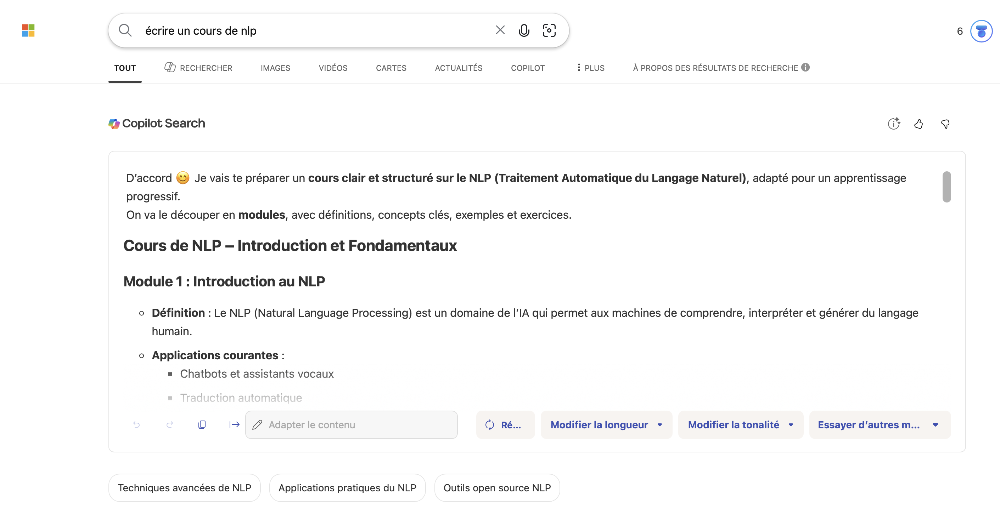

<!-- _class: title -->

# Introduction aux LLMs
## Séance 1 : Du NLP symbolique aux Transformers

**4ème année RO DEV - ESGI Paris**
Célia Nouri · `celia.nouri@inria.fr`
Semestre 2, 2025–2026

---

<!-- _class: section -->

# Plan de la séance

## ~2h de cours + lab Python (4h total)

---

## Au programme aujourd'hui

1. Introduction
2. Les bases du traitement automatique du langage
3. Rappels : Machine Learning & rétropropagation


> **Objectif** : construire une intuition solide sur le TAL (NLP) pour comprendre les LLMs dans les séances suivantes

---

## À propos de ce cours

<br>

| | |
|---|---|
| **Volume** | 20h; 5 séances de 4h |
| **Format** | ~2h cours + ~2h lab Python |
| **Éval** | QCM 40 questions (31 juillet) |
| **Prérequis** | Python, bases ML, APIs REST |

<br>

📧 Questions & bugs : `celia.nouri@inria.fr`

---

<!-- _class: section -->

# 1. Introduction

---
### Qu'est-ce que le TAL ?

Traitement automatique du langage (naturel, distinction avec le langage informatique ou code).
> **Discussion** : Qu'est-ce que le TAL ?

---

### Le langage est ambigu par nature

Le sens n’est pas uniquement contenu dans les mots eux-mêmes : il dépend de la syntaxe, du contexte discursif, de la situation d’énonciation, des connaissances du monde et des intentions du locuteur...

<br>

#### Ambiguïté lexicale
> *"Donne-moi la batterie."*
L'instrument de musique ? La pile électique ?
#### Ambiguïté syntaxique
> *"J'ai vu l'homme avec les jumelles."*
Qui a les jumelles ? Moi ou l'homme.
<br>
---

#### Connaissance du monde
> * "Marc s’est assis, a regardé le menu."
Sous-entendu : Marc est au restaurant.
#### Connaissances culturelles
"C'est pas mal."*
En français familier, c'est **bien** !
#### Ironie / Sarcasme
> Après 2h de retard : "Super, t’es vraiment ponctuel." 
Sens réel : critique / sens littéral: compliment.
#### Dépendance au contexte pragmatique
> "Tu peux ouvrir la fenêtre ?"
Sens réel : demande d'ouvrir. Sens littéral : capacité d'ouvrir.
<br>

---
### Le langage est ambigu par nature
<br/>

<center>

</center>

---

## Ce que les LLMs ont appris à modéliser

Pour désambiguïser, il faut comprendre le **contexte**.

<br>

*"La __batterie__ est déchargée"* → batterie électrique 
*"La __batterie__ est facile à apprendre"* → l'instrument de musique 

<br>

Les LLMs modernes produisent des **représentations différentes** pour le même mot selon son contexte. C'est la grande avancée par rapport aux représentations décontextualisées (pré-transformers). Mais cela ne suffit pas toujours à capturer les subtilités sociales, culturelles, conversationnelles du langage.

<br>

> **Discussion** : Donnez des exemples de mot/phrase français·e dont le sens change selon le contexte.

---
### Où trouver des données textuelles ?

> **Discussion** : Quelles sont les sources de données utilisées par le TAL.

<br/>

<center>

</center>

---
### Les sources de données en TAL
<br/>

<center>

</center>

---
### Historique des avancées en TAL

<center></center>

---

### Le TAL en 2025-2026
<br/>

<center>

</center>

---

### Le TAL en 2025-2026

<center>

</center>

---

### Le TAL en 2025-2026
> *Génère une image de l'école d'informatique en alternance à Paris (ESGI) avec le logo de l'école et une bannière.*

<center>

</center>

---

### Le TAL en 2025-2026
<center>

</center>


---

### Le TAL en 2025-2026

<center>

</center>

---

### Le TAL en 2025-2026

<center>

</center>

---
<!--_class: lead -->
# Est-ce que les tâches de TAL sont résolues ? <h3>(NON.)</h3>

---

### Le TAL en 2025-2026

<center>

</center>

---
### Le TAL en 2025-2026
<br>

<center>

</center>

---
### Le TAL en 2025-2026

<center>

</center>

---
### Organisation des séances
<br>
<br>

<div style="display: flex;">
    <div style="flex: 66%;">
        <center>
        </br>
        Célia Nouri  <br/> celia.nouri@inria.fr </center>
    </div>
</div>


---
### Organisation des séances

* Objectives 
    * ***Connaissances :*** comprendre l'architecture et le processus d'entraînement d'un LLM moderne, et les avancées récentes dans le domaine du TAL.
    * ***Mise en practice :*** Concevoir un système intégrant des LLMs modernes (RAG : Retrieval-Augmented Generation, agents) fonctionnel
    * ***Distance Critique :*** Comprendre les limites et problèmes actuels liés aux LLMs, et analyser les méthodes et avancées en maintenant une distance critique.
---

### Organisation des séances
* **Séance 1 (Aujourd'hui)**: Fondations : Introduction, Recap ML, embeddings, Transformers
* **Séance 2 (12 juin)**: Entrainement : Tokenization, Pré-entraînement, Fine-tuning, Alignement
* **Séance 3 (10 juillet)**: Utilisation et LLM-augmentés : Prompting, RAG 
* **Séance 4 (24 juillet)**: Agents : Toolformer, Architectures agentiques, 
* **Séance 5 (28 juillet)**: Frontière : Modèles de raisonnement, Multimodalité,   

* **Examen (31 juillet)**: QCM final 40 questions
---
<!-- _class: section -->

# 2. Les bases du traitement automatique du langage

---

## Qu'est-ce qu'un token ?

Un **token** = l'unité de base que le modèle traite. Ce n'est **pas forcément un mot**.

<br>


| Découpage | Résultat |
|---|---|
| Par mot | `[J', adore, ce, cours, !]` |
| Par sous-mot (BPE) | `[J', ador, ##e, ce, cours, !]` |
| Par caractère | `[J, ', a, d, o, r, e, ...]` |

<br>

Les LLMs modernes utilisent le **sous-mot** (WordPiece, SentencePiece, BPE). Vocabulaires de 30k–100k tokens.

---

## Pourquoi des sous-mots ?

<br>

**Par caractère** : séquences très longues, pas de sémantique
**Par mot entier** : mots rares, néologismes, formes fléchies (`courons`, `courais`…)
**Par sous-mot** : bon compromis : vocabulaire fini, mots inconnus décomposables, formes fléchies rassemblées

<br>

```
"ChatGPT" → ["Chat", "G", "PT"]    # mot inconnu → décomposé
"courons"  → ["cour", "ons"]       # morphologie préservée
```

<br>

On verra les algorithmes de tokenization dont BPE en détail en **séance 2**.

---

## Stemming vs Lemmatisation

Deux techniques pour **normaliser** les formes d'un mot.

<br>

**Stemming** : couper la fin, rapide mais approximatif
```
"courais", "courons", "courir"  →  "cour"   ← pas un vrai mot !
```

**Lemmatisation** : forme canonique, tient compte du contexte grammatical, mais coûteux
```
"courais", "courons", "courir"  →  "courir"
"meilleures", "meilleur"        →  "bon"   ← le lemme de "meilleur" !
```

<br>

Librairie recommandée : **`spaCy`** (Python)

---

## Stop words & Regex

**Stop words** : mots si fréquents qu'ils ne portent pas de sens discriminant.

```python
# Exemple avec spaCy
[token for token in doc if not token.is_stop]
# "le", "de", "et", "un"... → retirés
```

⚠️ Attention au contexte : *"Être ou **ne** **pas** être"* : les stop words comptent ici !

<br>

**Expressions régulières** : patterns pour extraire des structures dans le texte.

```python
import re
re.findall(r'\d{2}-\d{2}-\d{2}-\d{2}-\d{2}', texte)  # → numéros de téléphone
re.findall(r'[\w.-]+@[\w.-]+\.\w+', texte)             # → emails
```

---

## La loi de Zipf

Dans **toute** langue humaine : le mot le plus fréquent apparaît ~2× plus que le 2e, ~3× plus que le 3e…

<br>

```
Rang 1  : "le"   → ~7% de tous les tokens
Rang 2  : "de"   → ~3.5%
Rang 10 : "un"   → ~0.7%
Rang 100: ...    → très rare
```

<br>

**Conséquence pratique** :
- ~100 mots couvrent ~50% de tout texte
- La grande majorité du vocabulaire est **très rare**
- Les modèles doivent gérer des données très déséquilibrées

---
## La loi de Zipf

<center></center>

---

<!-- _class: quiz -->

## 🧩 Quiz 1

<br>

**Le lemme du mot "allées"** (dans *"les allées du parc"*) est :

<br>

- **A)** "allé"
- **B)** "aller"
- **C)** "allée"
- **D)** "alle"

<br>

*→ Réponse dans 30 secondes*

---

<!-- _class: quiz -->

## 🧩 Quiz 1 : Réponse

**Réponse : C : "allée"**

<br>

*"Allées"* est ici un **nom commun** (*les allées du parc*).
Le lemme d'un nom commun est son singulier : `allée`.

<br>

Si c'était le **participe passé** du verbe *aller* (*"elles sont allées"*),
le lemme serait `aller`.

<br>

> **Le contexte grammatical change le lemme** : c'est pourquoi la lemmatisation demande une analyse syntaxique, pas juste une règle de troncature.

---

<!-- _class: section -->

# 3. Rappel Machine Learning

---

## C'est quoi, l'apprentissage machine ?

Un modèle ML = une **fonction paramétrique**.

<br>

$$\hat{y} = f(x\,;\,\theta)$$

<br>

- $x$ = entrée (texte, image…)
- $\hat{y}$ = prédiction du modèle
- $\theta$ = **paramètres** (poids); des millions voire milliards de variables à calibrer

<br>

**Apprendre** = trouver les $\theta$ qui minimisent l'écart entre $\hat{y}$ et la vraie réponse $y$.

---

## La fonction de perte (Loss)

On mesure l'erreur du modèle avec une **fonction de perte** $\mathcal{L}$.

<br>

Pour une classification binaire (ex. spam / pas spam) :

$$\mathcal{L} = -\left[\, y \cdot \log(\hat{y}) + (1-y) \cdot \log(1-\hat{y}) \,\right]$$

C'est la **cross-entropy**. Plus $\mathcal{L}$ est faible, mieux le modèle prédit.

<br>

**Objectif** : trouver $\theta^*$ tel que $\mathcal{L}$ soit minimale sur les données d'entraînement.

**Discussion** : comment trouver le minimum (s'il existe) de la fonction de perte ? 

---

## Descente de gradient

L'objectif est de trouver le minimum de la fonction de perte, mais dans le cas des réseaux de neurones, cette fonction est la fonction est très complexe, non linéaire et multidimensionnelle.
Il impossible de résoudre ce problème directement avec la formule exacte "dérivée = 0". 

Idée : se déplacer dans la direction qui **réduit** la fonction de perte.

$$\theta \leftarrow \theta - \alpha \cdot \frac{\partial \mathcal{L}}{\partial \theta}$$

- $\alpha$ = **learning rate** (taux d'apprentissage), un hyperparamètre crucial
- $\frac{\partial \mathcal{L}}{\partial \theta}$ = gradient = direction de la pente ascendante
- on se déplace à chaque étape de l'apprentissage en direction - $\frac{\partial \mathcal{L}}{\partial \theta} x \alpha$ 

<br>

**Analogie** : vous êtes dans le brouillard sur une montagne. Vous voulez descendre dans la vallée. À chaque pas, vous regardez la pente sous vos pieds et avancez dans la direction la plus raide vers le **bas**.

---

## Rétropropagation (Backpropagation)

Dans un réseau de neurones, le gradient se calcule par **rétropropagation** :

<br>

```
Forward pass :
  x → [Couche 1] → [Couche 2] → [Couche 3] → ŷ → L

Backward pass (règle de la chaîne) :
  ∂L/∂θ₁ ← ∂L/∂θ₂ ← ∂L/∂θ₃ ← ∂L/∂ŷ
```

<br>

La **règle de la chaîne** permet de calculer les gradients couche par couche, de la sortie vers l'entrée.

PyTorch / TensorFlow font ça automatiquement (**autograd**).

---

## Surapprentissage (Overfitting)

Le modèle **mémorise** les données d'entraînement au lieu d'en apprendre les patterns.

<br>

| | Train accuracy | Test accuracy |
|---|---|---|
| Bon modèle | 92% | 89% |
| Overfitting | 99% | 62% |

<br>

**Solutions courantes** :
- **Dropout** : désactiver des neurones aléatoirement pendant l'entraînement
- **Weight decay** : pénaliser les poids trop grands ($L_2$ régularisation)
- **Early stopping** : arrêter quand la validation stagne
- **Plus de données** : (et des données plus diverses et représentatives), le remède le plus efficace

---

<!-- _class: quiz -->

## 🧩 Quiz 2

<br>

Un modèle atteint **99% d'accuracy** sur les données d'entraînement et **62%** sur les données de test.

<br>

Que se passe-t-il ?

- **A)** Le modèle est parfait, 99% c'est excellent
- **B)** Il y a du surapprentissage (*overfitting*)
- **C)** Les données de test sont mauvaises
- **D)** Le learning rate est trop élevé

---

<!-- _class: title -->

# Séance 2 : 12 juin
## Représentations vectorielles du texte : comment traduire des mots en vecteurs ?

Vecteurs de mots · Bag-of-Words · Word2Vec · 
Architectures traitement du texte · RNNs · Transformers 

**Lectures conseillées** :
Vaswani et al. (2017), "Attention is All You Need" : abstract + intro

`celia.nouri@inria.fr`