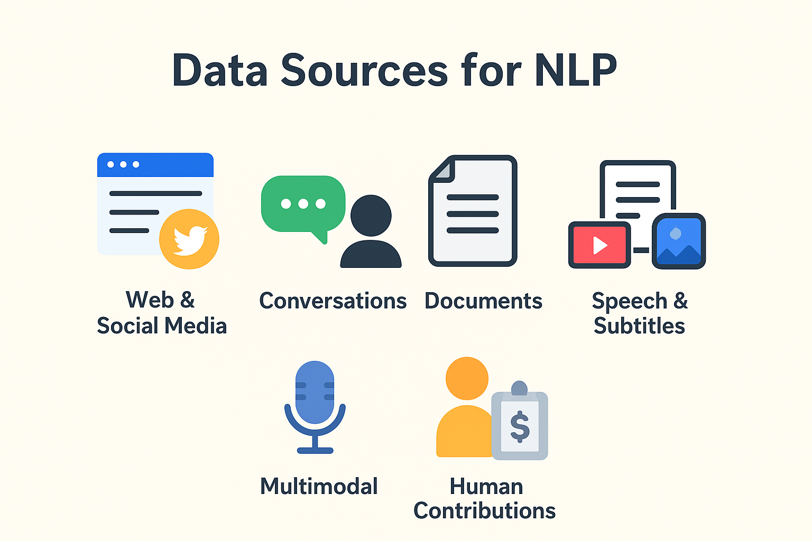
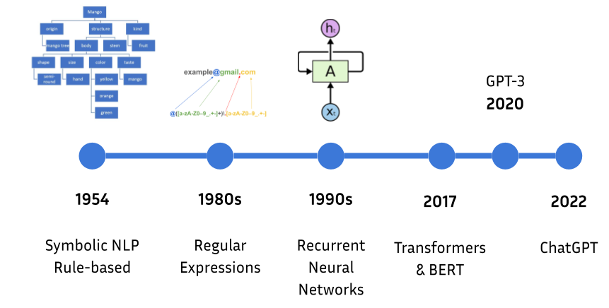
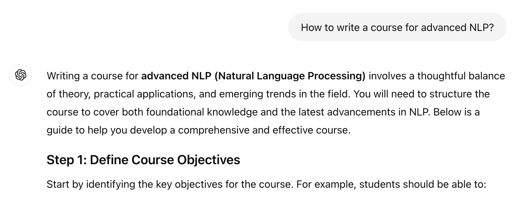
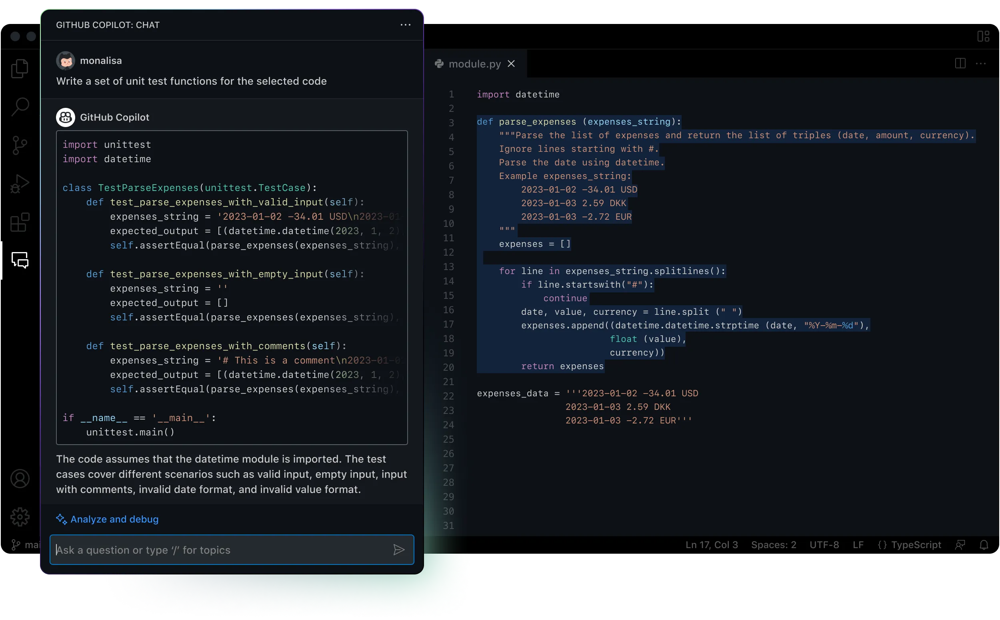
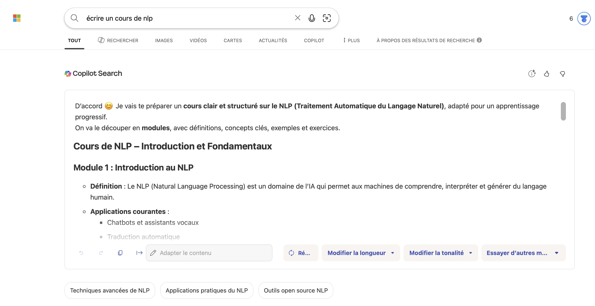
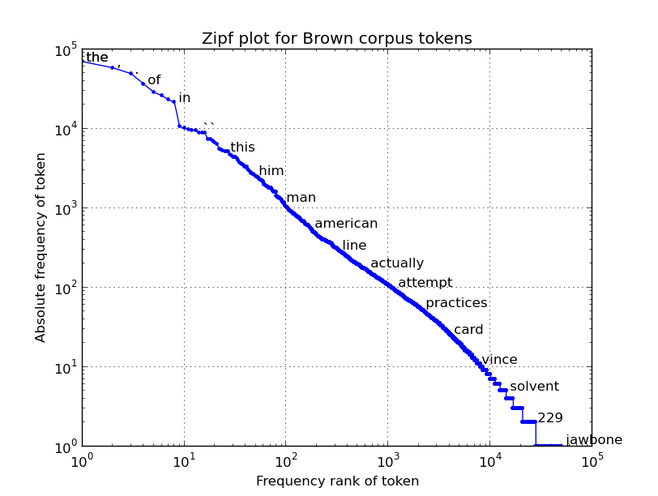
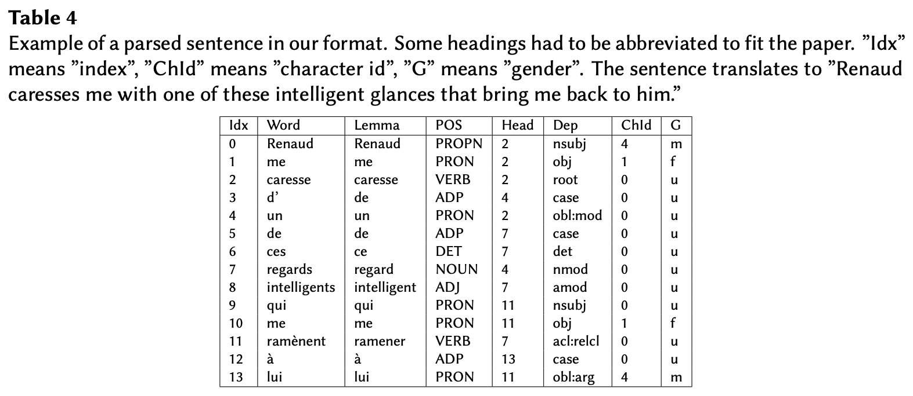
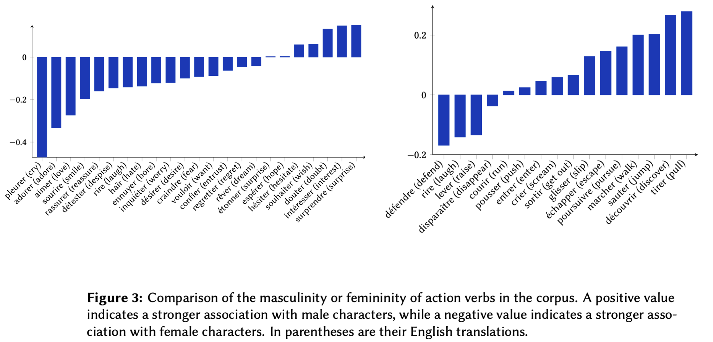

<!-- _class: title -->

# Introduction aux LLMs
## Séance 1 : Introduction au traitement automatique des langues et apprentissage machine 

**ESGI Paris**
Célia Nouri · `celia.nouri@inria.fr`
Semestre 1, 2026–2027

---

<!-- _class: section -->

# Plan de la séance

## 2h de cours + lab Python (3h total)

---

## Au programme aujourd'hui

1. Introduction : qu'est-ce que le TAL ?
2. Le TAL avant le machine learning
3. Les bases du machine learning

> **Objectif** : construire une intuition solide sur le TAL (NLP) et le machine learning pour comprendre les LLMs dans les séances suivantes

---

## À propos de ce cours

<br>


- **Volume** : 15h; 4 séances de 3h ou 4h30 
- **Format** : 2-3h cours + 30min-1h lab Python 
- **Éval** : QCM 40 questions 
- **Prérequis** : Python, bases ML, APIs REST 

<br>

📧 Questions & bugs : `celia.nouri@inria.fr`

---

<!-- _class: section -->

# 1. Introduction

---
### Qu'est-ce que le TAL ?

**TAL** = **T**raitement **A**utomatique des **L**angues (en anglais : *NLP, Natural Language Processing*)

Les langues ou langage naturel (français, anglais, arabe…), à distinguer des langages informatiques (Python, SQL…) qui suivent des règles strictes et non ambiguës.

Deux mots, deux disciplines :
1. **Le langage** → la **linguistique**
2. **Le traitement automatique** → l'**informatique** (statistiques, machine learning)

---
### (1) Le langage : la linguistique

La **linguistique** = l'étude du langage humain. Quelles sont les règles qui le gouvernent ?

<br>

- **Phonologie** : organisation et fonction des sons (les phonèmes) au sein d'une langue particulièreles
- **Morphologie** : la forme des mots (*« irresponsables » =>  ir- + respons- + -able- + -s *)
- **Syntaxe** : l'ordre et la structure des phrases (*« Le chat mange la souris »* ≠ *« La souris mange le chat »*)
- **Sémantique** : le sens des mots et des phrases 
- **Pragmatique** : le sens en situation (*« Tu peux ouvrir la fenêtre ? »* est une demande, pas une question)

<br>

---
### Le langage varie et évolue

Le langage est aussi **social et culturel** : il varie selon les régions, les groupes sociaux, les époques et les registres.

<br>

- **Variations régionales** : *pain au chocolat* / *chocolatine* ; *« septante »* (Belgique, Suisse) / *« soixante-dix »* (France) ; *« char »* (Québec) = voiture
- **Registres** : *« Je n'ai pas compris »* / *« J'ai pas capté »*
- **Évolution** : nouveaux mots (*« liker », « ghoster »*), sens qui changent, langage SMS et réseaux sociaux
- **Culture** : expressions (*« Avoir le cafard »*, *« Poser un lapin »*)

<br>

---

### Le langage est ambigu par nature

Le sens n’est pas uniquement contenu dans les mots eux-mêmes : il dépend de la syntaxe, du contexte discursif, de la situation d’énonciation, des connaissances du monde et des intentions du locuteur, etc...

<br>

#### Ambiguïté lexicale
> *"Donne-moi la batterie."*
L'instrument de musique ? La pile électrique ?
#### Connaissance du monde
> *"Marc s’est assis, a regardé le menu."*
Sous-entendu : Marc est au restaurant.
#### Ironie / Sarcasme
> Après 2h de retard : *"Super, t’es vraiment ponctuel."*
Sens réel : critique / sens littéral : compliment.

---
### (2) Le traitement automatique

Traitement automatique par ordinateur, exécute des suites d'instructions pour effectuer des calculs arithmétiques et des opérations logiques sur des chiffres binaires (0/1).
Comment faire manipuler du langage par un ordinateur? 

<br>

- **Avant le machine learning** : on **compte** et on applique des **règles écrites à la main**
  *Statistiques sur les mots, stop words, stemming, lemmatisation, expressions régulières, POS tagging, analyse en dépendances…*
- **Machine learning** : la machine **apprend** les régularités à partir d'exemples
  *Représenter les mots par des vecteurs (Word2Vec)*
- **Deep learning** : des réseaux de neurones profonds
  *RNN, puis Transformers, puis LLMs*
- **Aujourd'hui** : intégration d'outils, mémoire, et systèmes agentiques

---
### Tâches classiques du TAL

<br>

| Tâche | Exemple |
|---|---|
| **Étiquetage de séquences** | Repérer les noms de personnes, de lieux (NER), la nature des mots (POS tagging) |
| **Classification de texte** | Ce mail est-il un spam ? Cet avis est-il positif ? |
| **Traduction automatique** | *« Bonjour »* → *« Hello »* |
| **Résumé automatique** | Condenser un article en 3 phrases |
| **Question-réponse** | *« Quelle est la capitale de l'Australie ? »* |
| **Génération de texte** | Rédiger un mail, écrire du code |

---
### Les données textuelles

> **Discussion** : Quelles sont les sources de données utilisées par le TAL.

<br/>

<center>

</center>

---
### Les sources de données en TAL
<br/>

<center>

</center>

---
### Historique des avancées en TAL

| Période | Approche | Repères |
|---|---|---|
| **1950–1980s** | Règles écrites à la main (symbolique) | ELIZA (1966), grammaires formelles |
| **1990–2000s** | Statistiques : on compte les mots | *n*-grammes, Zipf, *bag of words*, TF-IDF |
| **2013** | Machine learning : embeddings | Word2Vec |
| **2014–2017** | Deep learning : réseaux récurrents | RNN, LSTM, seq2seq |
| **2017** | Transformers | *Attention Is All You Need* |
| **2018–2022** | Modèles pré-entraînés, LLMs | BERT, GPT-3, ChatGPT (fin 2022) |
| **2023–…** | Raisonnement, outils, agents | Toolformer, o1, DeepSeek-R1, agents |

---
### Historique des avancées en TAL

<center></center>

---

### Le TAL en 2025-2026
<br/>

<center>

</center>

---

### Le TAL en 2025-2026

<center>

</center>

---

### Le TAL en 2025-2026
> *Génère une image de l'école d'informatique en alternance à Paris (ESGI) avec le logo de l'école et une bannière.*

<center>

</center>

---

### Le TAL en 2025-2026
<center>

</center>

---

### Le TAL en 2025-2026

<center>

</center>

---
### Organisation des séances
<br>
<br>

<div style="display: flex;">
    <div style="flex: 66%;">
        <center>
        </br>
        Célia Nouri  <br/> celia.nouri@inria.fr </center>
    </div>
</div>


---
### Organisation des séances

* Objectives 
    * ***Connaissances :*** comprendre l'architecture et le processus d'entraînement d'un LLM moderne, et les avancées récentes dans le domaine du TAL.
    * ***Mise en practice :*** Concevoir un système intégrant des LLMs modernes (RAG : Retrieval-Augmented Generation, agents) fonctionnel
    * ***Distance Critique :*** Comprendre les limites et problèmes actuels liés aux LLMs, et analyser les méthodes et avancées en maintenant une distance critique.
---

### Organisation des séances
* **Séance 1 (Aujourd'hui)**: Fondations : Introduction TAL et ML 
* **Séance 2 (29 octobre)**: Word Embeddings, Tokenization, Transformers 
* **Séance 3 (30 octobre)**: Entraînement: pré-entraînement et post-entrainement, Utilisation et LLM-augmentés : Prompting, RAG 
* **Séance 5 (27 novembre)**: Toolformer, Architectures agentiques + Modèles de raisonnement (bonus: Multimodalité)   

* **Examen**: QCM final 40 questions
---
<!-- _class: section -->

# 2. Le TAL avant le machine learning


---

## Étudier le langage automatiquement

Avant le machine learning, on étudie le langage **avec des règles et des statistiques** :

1. **Trouver des patterns** dans les textes
2. **Les associer à des phénomènes** qu'on veut étudier ou détecter

---

## La loi de Zipf

Une régularité statistique observée dans **toutes** les langues : la fréquence d'un mot est **inversement proportionnelle à son rang**.

<br>

$$f(r) \propto \frac{1}{r}$$

<br>

- Le mot le plus fréquent apparaît ~2× plus que le 2ème, ~3× plus que le 3ème…
- ~100 mots couvrent ~50% de tout texte
- La grande majorité du vocabulaire est **très rare**

<br>

**Conséquence** : les mots les plus fréquents (*« le », « de », « et »*) sont partout, donc ne nous apprennent rien sur le sujet d'un texte.

---
## La loi de Zipf


<center></center>

---


## Un exemple d'étude de TAL

**Questions** : quels verbes/adjectifs sont les plus associés aux personnages **féminins** ou **masculins** dans un roman ?

> Article : **Gender Bias in French Literature** (Vianne, Dupont, Barré, CHR 2023)

---

## Étude : biais de genre dans la littérature française

<br>

- **Corpus** : 2 942 romans français de 1811 à 2020
- **Objectif** : les personnages sont-ils décrits différemment selon leur genre ?
- **Méthode** :
  1. Repérer les personnages et leurs mentions (*il, elle, Jeanne…*)
  2. Analyser chaque phrase avec spaCy (**lemmatisation**, **POS tagging**, **analyse en dépendances**)
  3. Extraire les **verbes** et **adjectifs** liés à chaque personnage
  4. **Compter** les lemmes par personnage (*bag of words*)


---

## Part-of-speech (POS) tagging 

Détecter automatiquement la fonction grammaticale de chaque mot dans un texte. 

<center></center>


---

## Stop words

**Stop words** = mots si fréquents qu'ils ne portent pas de sens discriminant.

*le, la, les, un, une, des, de, du, et, ou, est, à, dans, pour, que, qui, ce, il, elle, je, tu, ne, pas*

On cherche a les retirer pour de nombreuses tâches de TAL.
**Exemple** : on cherche les mots les plus associés au genre masculin ou féminin, en comptant ses mots.

```python
# Exemple avec spaCy
[token for token in doc if not token.is_stop]
```

---

## Stemming vs Lemmatisation

Un même mot existe sous plusieurs formes : **pluriel, masculin/féminin, conjugaison, suffixes, préfixes**.

*manger, mangeons, mangeait, mangé* · *heureux, heureuse, heureuses* · *lait, laitier, laiterie*

Une même **racine** = un même **sens**. On veut les regrouper pour compter correctement.

<br>

**Stemming** : couper la fin, rapide mais approximatif
```
"courais", "courons", "courir"  →  "cour"   ← pas un vrai mot !
```

**Lemmatisation** : forme canonique, tient compte du contexte grammatical, mais plus coûteux
```
"courais", "courons", "courir"  →  "courir"
"meilleures", "meilleur"        →  "bon"   ← le lemme de "meilleur" !
```

Librairie recommandée : **`spaCy`** (Python)


---

## Résultats : des verbes genrés

<center></center>


<br>

- **Féminin** : *pleurer, aimer, rire, regretter, rêver* : expression des **émotions**
- **Masculin** : *tirer, découvrir, marcher, sortir* : verbes d'**action** 
- Score d'agentivité (sujet vs objet de la phrase) : **0,70** pour les hommes, **0,64** pour les femmes
- Un simple **comptage de lemmes** met en évidence des stéréotypes présents dans des centaines de romans.


---

## Expressions régulières (regex)

Une **regex** décrit un **pattern** de texte, pour retrouver automatiquement des structures.

**Exemple** : extraire les numéros de téléphone, les adresses et les emails d'un texte.

```python
import re

texte = "Marie, 12 bis rue de la Paix, 75002 Paris. Tél : 06.12.34.56.78"

re.findall(r'(?:\+33\s?|0)[1-9](?:[ .-]?\d{2}){4}', texte)
# → ['06.12.34.56.78']                       (numéros de téléphone)

re.findall(r"\d{1,3}(?: bis| ter)? (?:rue|avenue|boulevard|place) [\w' -]+, \d{5} [A-ZÉ][\w-]+", texte)
# → ['12 bis rue de la Paix, 75002 Paris']   (adresses)

re.findall(r'[\w.-]+@[\w.-]+\.\w+', texte)
# → emails
```

---

<!-- _class: quiz -->

## 🧩 Quiz 1

<br>

**Le lemme du mot "allées"** (dans *"les allées du parc"*) est :

<br>

- **A)** "allé"
- **B)** "aller"
- **C)** "allée"
- **D)** "alle"

<br>

*→ Réponse dans 30 secondes*

---

<!-- _class: quiz -->

## 🧩 Quiz 1 : Réponse

**Réponse : C : "allée"**

<br>

*"Allées"* est ici un **nom commun** (*les allées du parc*).
Le lemme d'un nom commun est son singulier : `allée`.

<br>

Si c'était le **participe passé** du verbe *aller* (*"elles sont allées"*),
le lemme serait `aller`.

<br>

> **Le contexte grammatical change le lemme** : c'est pourquoi la lemmatisation demande une analyse syntaxique, pas juste une règle de troncature.

---

<!-- _class: section -->

# 3. Introduction au Machine Learning

---

## C'est quoi, l'apprentissage machine ?

Au lieu d'écrire les règles à la main, on **laisse la machine les découvrir à partir de données exemples**.

<br>

Un modèle de ML = une **fonction paramétrique** qui **modélise les données** :

$$\hat{y} = f(x\,;\,\theta)$$

<br>

- $x$ = entrée (texte, image…)
- $\hat{y}$ = prédiction du modèle
- $\theta$ = **paramètres** (poids) : variables que l'on ajuste ; de quelques dizaines à des milliards

<br>

**Apprendre** = optimiser $\theta$ pour que la fonction **reproduise les données**, c'est-à-dire que $\hat{y}$ soit proche de la vraie réponse $y$.

---

## La méthode en 4 étapes

<br>

1. **Source de données** : collecter des exemples
2. **Définir la tâche d'apprentissage** par une **fonction paramétrique** $f(x\,;\,\theta)$ et une mesure de l'erreur (la fonction de perte)
3. **Optimiser** la fonction sur des données d'**entraînement**
4. **Tester la généralisation** sur des données qu'elle n'a jamais vues

<br>

> Ce qui compte n'est pas d'obtenir un bon score sur les exemples déjà vus (le modèle pourrait simplement mémoriser les données d'entrainement), mais sur **de nouveaux exemples**.

---

## Séparer les données : train / validation / test

On découpe les données en **trois ensembles** :

<br>

| Ensemble | Rôle | Analogie |
|---|---|---|
| **Entraînement** (*train*) | Optimiser les paramètres $\theta$ | Les exercices qu'on travaille |
| **Validation** | Choisir les réglages (hyperparamètres), détecter le surapprentissage | Les examens blancs |
| **Test** | Mesure finale, utilisée **une seule fois** | L'examen final |

<br>

Exemple de découpage : **80 %** / **10 %** / **10 %**.
Règle d'or: ne jamais entrainer le modèle sur les données de test, sinon le score est truqué.

---

## Supervisé vs non supervisé

<br>

| | **Supervisé** | **Non supervisé** |
|---|---|---|
| **Données** | Entrées $x$ **avec** la réponse $y$ (labels) | Entrées $x$ **sans** label |
| **Objectif** | Prédire $y$ à partir de $x$ | Découvrir une structure dans les données |
| **Exemples** | Détection de spam, traduction, analyse de sentiment | Clustering, Word2Vec |

<br>

Les labels demandent souvent du **travail humain** (annotation) qui est très coûteux. Les algorithmes non supervisé fonctionnent sans label, mais ne sont pas adaptés pour toutes les tâches.

---

## Exemple supervisé : détecter les spams

**Tâche** : dire si un email est un spam.

<br>

1. **Données** : 5 000 emails
2. **Labels** : chaque email est annoté **spam** ($y=1$) ou **non-spam** ($y=0$)
3. **Fonction** : $f(x=\text{email}) = y=\text{label}$

<br>

| Email | Label |
|---|---|
| *« Gagnez 1000 € maintenant, cliquez ici ! »* | spam |
| *« Réunion de projet demain à 10h »* | non-spam |

---

## Spam : représenter l'email par des nombres

Un ordinateur ne calcule que sur des **nombres**. On compte les mots (comme dans la partie 2) :

<br>

$x$ = vecteur des **occurrences de chaque mot** du vocabulaire

```
vocabulaire :   gagnez  cliquez  réunion  demain  ...
email 1     :     1        1        0       0     ...   (spam)
email 2     :     0        0        1       1     ...   (non-spam)
```

<br>

$$\hat{y} = \sigma(w \cdot x + b) \in [0,1]$$

- $w$ : un **poids par mot** (*« gagnez » → poids élevé* : signal de spam)
- $\sigma$ : transforme le score en **probabilité** d'être un spam
- **Paramètres** $\theta = (w, b)$ : avec un vocabulaire de 10 000 mots, **10 001 paramètres** à optimiser (contre des milliards pour un LLM)

---

## La fonction de perte (Loss)

On mesure l'erreur du modèle avec une **fonction de perte** $\mathcal{L}$.

<br>

Pour une classification binaire (ex. spam / pas spam) :

$$\mathcal{L} = -\left[\, y \cdot \log(\hat{y}) + (1-y) \cdot \log(1-\hat{y}) \,\right]$$

C'est la **cross-entropy**. Plus $\mathcal{L}$ est faible, mieux le modèle prédit.

<br>

Un email est un spam ($y=1$) :
- le modèle dit $\hat{y}=0{,}9$ → $\mathcal{L} \approx 0{,}11$ (petite erreur)
- le modèle dit $\hat{y}=0{,}1$ → $\mathcal{L} \approx 2{,}30$ (grosse erreur)

<br>

**Objectif** : trouver $\theta^*$ tel que $\mathcal{L}$ soit minimale sur les données d'entraînement.

**Discussion** : comment trouver le minimum (s'il existe) de la fonction de perte ? 

---

## Descente de gradient

**Entraîner** le filtre à spam = trouver les $\theta$ qui minimisent la perte sur les **80 % de données d'entraînement**.

Pour les réseaux de neurones, la fonction de perte est très complexe, non linéaire et multidimensionnelle : impossible de résoudre directement "dérivée = 0".

Idée : se déplacer dans la direction qui **réduit** la fonction de perte.

$$\theta \leftarrow \theta - \alpha \cdot \frac{\partial \mathcal{L}}{\partial \theta}$$

- $\alpha$ = **learning rate** (taux d'apprentissage), un hyperparamètre crucial
- $\frac{\partial \mathcal{L}}{\partial \theta}$ = gradient = direction de la pente ascendante
- on se déplace à chaque étape de l'apprentissage en direction - $\frac{\partial \mathcal{L}}{\partial \theta} x \alpha$ 

<br>

**Analogie** : vous êtes dans le brouillard sur une montagne. Vous voulez descendre dans la vallée. À chaque pas, vous regardez la pente sous vos pieds et avancez dans la direction la plus raide vers le **bas**.

---

## Rétropropagation (Backpropagation)

Dans un réseau de neurones, le gradient se calcule par **rétropropagation** :

<br>

```
Forward pass :
  x → [Couche 1] → [Couche 2] → [Couche 3] → ŷ → L

Backward pass (règle de la chaîne) :
  ∂L/∂θ₁ ← ∂L/∂θ₂ ← ∂L/∂θ₃ ← ∂L/∂ŷ
```

<br>

La **règle de la chaîne** permet de calculer les gradients couche par couche, de la sortie vers l'entrée.

PyTorch / TensorFlow font ça automatiquement (**autograd**).

---

## Surapprentissage (Overfitting)

Le modèle **mémorise** les données d'entraînement au lieu d'en apprendre les patterns.

On le détecte en comparant les scores sur l'**entraînement** et sur la **validation / le test**.

<br>

| | Accuracy train | Accuracy test |
|---|---|---|
| Bon modèle | 92% | 89% |
| Overfitting | 99% | 62% |

<br>

**Solutions courantes** :
- **Dropout** : désactiver des neurones aléatoirement pendant l'entraînement
- **Weight decay** : pénaliser les poids trop grands ($L_2$ régularisation)
- **Early stopping** : arrêter quand la validation stagne
- **Plus de données** : (et des données plus diverses et représentatives), le remède le plus efficace

---

## Spam : évaluer sur les données de test

Après l'entraînement (descente de gradient sur les 80 % d'entraînement), on **évalue sur les 10 % de test**, jamais vus par le modèle :

<br>

- **Accuracy** : part des emails correctement classés
- **Précision / rappel** : combien de vrais spams détectés, combien de fausses alertes

<br>

> Un bon filtre à spam n'est pas celui qui connaît ses 4 000 emails d'entraînement, mais celui qui classe correctement **les emails de demain**.

---

## Exemple non supervisé : découvrir des groupes

Pas de labels : on donne seulement les données, la machine **cherche une structure**.

<br>

- **Clustering** : regrouper des articles de presse par thème (sport, politique, culture…) **sans** avoir dit quels thèmes existent
- **Word2Vec** : apprendre à représenter les mots par des vecteurs en observant quels mots apparaissent ensemble → **prochaine partie**

<br>

Le non supervisé est à la base des **LLMs** : ils apprennent à partir de quantités énormes de texte **sans annotation manuelle** (séance 2).

---

<!-- _class: quiz -->

## 🧩 Quiz 2

<br>

Un modèle atteint **99% d'accuracy** sur les données d'entraînement et **62%** sur les données de test.

<br>

Que se passe-t-il ?

- **A)** Le modèle est parfait, 99% c'est excellent
- **B)** Il y a du surapprentissage (*overfitting*)
- **C)** Les données de test sont mauvaises
- **D)** Le learning rate est trop élevé

---

<!-- _class: title -->

# Séance 2 : 29 octobre
## Représentations vectorielles du texte : comment traduire des mots en vecteurs ?

Vecteurs de mots · Bag-of-Words · Word2Vec · 
Architectures traitement du texte · RNNs · Transformers 

**Lectures conseillées** :
Vaswani et al. (2017), "Attention is All You Need" : abstract + intro

`celia.nouri@inria.fr`