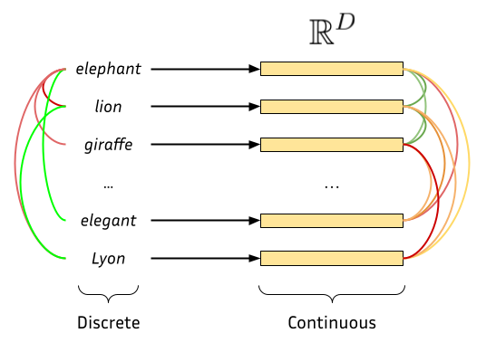
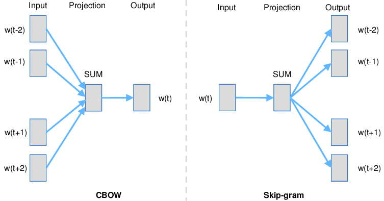
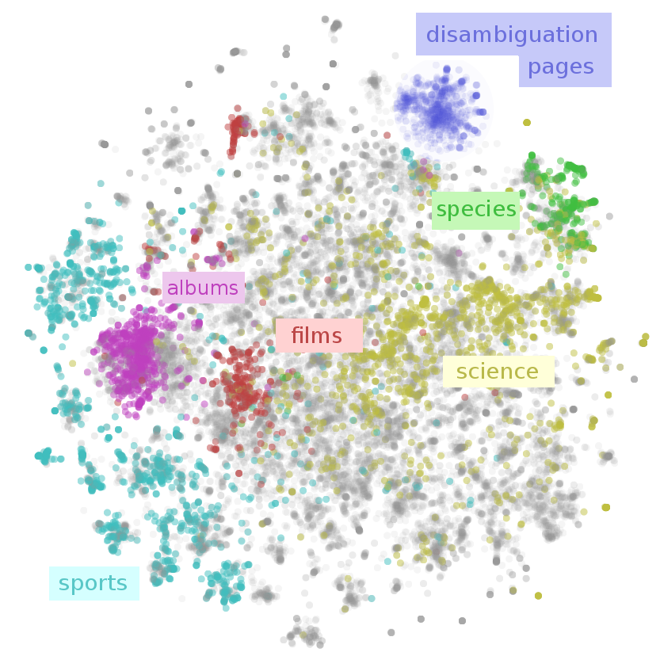
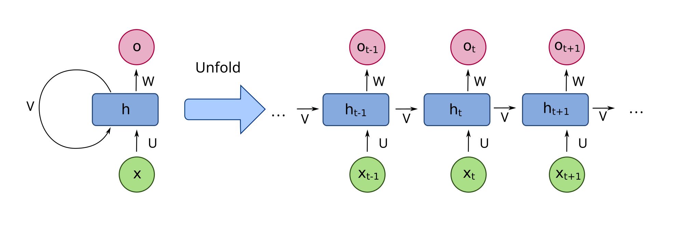
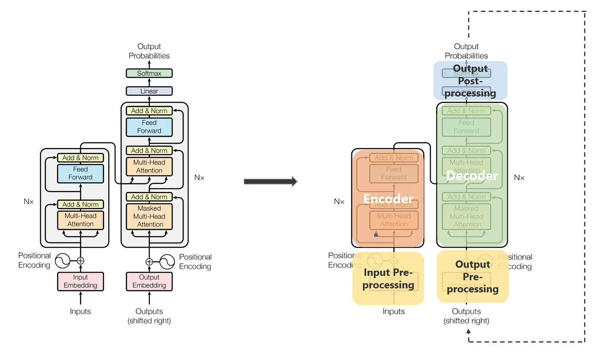
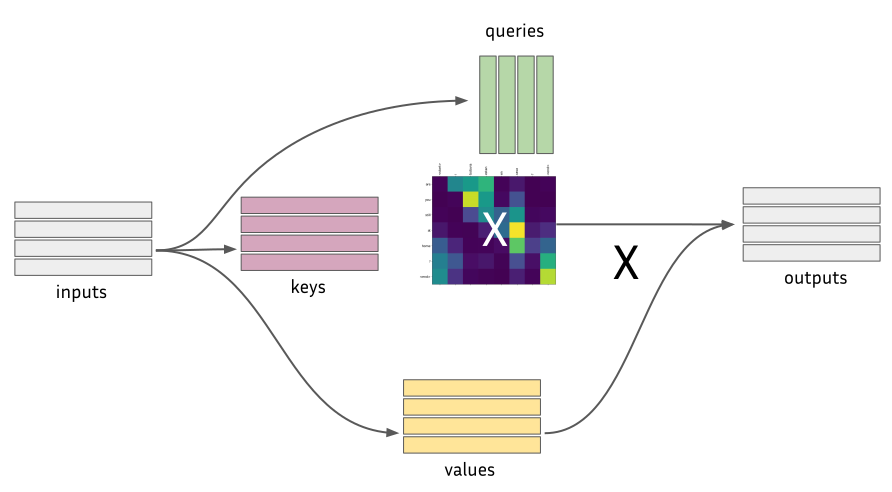

<!-- _class: title -->

# Introduction aux LLMs
## Séance 2 : Représentations vectorielles du texte

**4ème année RO DEV - ESGI Paris**
Célia Nouri · `celia.nouri@inria.fr`
Semestre 2, 2025–2026

---

## Au programme aujourd'hui

1. Recap
2. Représentations vectorielles des mots : de Bag-of-Words à Word2Vec
3. Les RNNs
4. L'architecture Transformer

---
<!-- _class: section -->

# 1. Récapitulatif

---

<!-- _class: quiz -->

## 🧩 Quiz rapide — séance 1

<br>

**1.** Quelle est la différence entre un **token** et un **mot** ?

**2.** Quelle technique donne la forme canonique d'un mot en tenant compte de sa catégorie grammaticale ?

**3.** Pourquoi retire-t-on les *stop words* dans certaines tâches NLP ?

**4.** Qu'est-ce que la **descente de gradient** ? Écrivez la règle de mise à jour des paramètres.

**5.** Comment reconnaît-on un modèle en **surapprentissage** (*overfitting*) ?

---

## Ce que vous devez retenir

<br>

- **Token** ≠ mot — les LLMs opèrent sur des **sous-mots** (BPE, WordPiece) ; vocabulaires de 30k–100k entrées.
- **Stop words** → mots très fréquents sans sens discriminant (*"le"*, *"de"*, *"et"*…) ; souvent retirés en pré-traitement ⚠️ pas toujours.
- **Stemming** → troncature brute (`"courais"` → `"cour"`) ; **Lemmatisation** → forme canonique selon le contexte grammatical (`"courais"` → `"courir"`).
- **Descente de gradient** → $\theta \leftarrow \theta - \alpha \cdot \frac{\partial \mathcal{L}}{\partial \theta}$ : on se déplace à chaque étape dans la direction qui **réduit** la perte.
- **Surapprentissage** → train accuracy élevée, test accuracy basse → solutions : Dropout, early stopping, plus de données.

---

<!-- _class: section -->

# 2. Représenter les mots en vecteurs

---

## Le problème central

Les modèles mathématiques ne comprennent que des **chiffres**.

Il faut **encoder** le texte sous forme de vecteurs numériques.

<br>

Trois générations de méthodes :

| | Méthode | Sémantique |
|---|---|---|
| 1️⃣ | One-Hot / BoW / TF-IDF | ❌ aucune |
| 2️⃣ | Word2Vec, GloVe, FastText | ✅ statique |
| 3️⃣ | BERT, GPT (Transformers) | ✅✅ contextuelle |

---
## Représentations vectorielles (embeddings)

<center></center>

---

## One-Hot Encoding

Chaque mot = un vecteur de la taille du vocabulaire avec un **1** à sa position dans le vocabulaire, et des **0** partout ailleurs.

<br>

```
Vocabulaire : [chat, chien, maison, voiture, soleil]

chat    = [1, 0, 0, 0, 0]
chien   = [0, 1, 0, 0, 0]
maison  = [0, 0, 1, 0, 0]
```

<br>

**Problèmes** :
- Vecteurs immenses (taille du vocabulaire ≥ 50 000)
- Aucune relation entre mots : `chat` et `chien` sont aussi différents que `chat` et `voiture`
- Très creux (*sparse*) → inefficace en mémoire

---

## Bag of Words (BoW)

Pour une phrase : compter les occurrences de chaque mot du vocabulaire.

<br>

**Phrase** : *"Le chat mange le poisson"*
**Vocabulaire** : `[chat, chien, mange, poisson, maison, le]`

```
BoW = [1, 0, 1, 1, 0, 2]
```

<br>

✅ Simple, fonctionne pour la classification de documents
❌ L'ordre des mots est perdu :
*"Le chat mange le poisson"* = *"Le poisson mange le chat"* 

---

## TF-IDF

Amélioration de BoW : pondérer les mots par leur **rareté** dans le corpus.

$$\text{TF-IDF}(t, d) = \underbrace{\text{TF}(t,d)}_{\text{fréq. dans le doc}} \times \underbrace{\log\!\left(\frac{N}{\text{df}(t)}\right)}_{\text{rareté globale}}$$

<br>

- **TF** : fréquence du terme $t$ dans le document $d$
- **df** : nombre de documents contenant $t$
- **N** : nombre total de documents

<br>

*"le"*, *"de"* apparaissent partout → IDF faible → peu d'importance
*"transformer"*, *"tokenisation"* → IDF élevé → très informatifs

---

## TF-IDF

<center></center>

---

## Word2Vec (2013)

**Mikolov et al., Google, 2013** (probablement le papier en TAL le plus influent avant les Transformers).

<br>

**Idée clé** (Firth, 1957) :
> *"A word is known by the company it keeps."*

Le sens d'un mot peut être inféré en regardant les mots qui l'**entourent**.

<br>

Word2Vec entraîne un petit réseau sur une tâche simple :
- **Skip-gram** : étant donné un mot central, prédire les mots du contexte
- **CBOW** : étant donné le contexte, prédire le mot central

---
## Word2Vec : Comment ça marche ?

Apprend les représentations vectorielles des mots **sans supervision**.
<br>
<center></center>

---
## Word2Vec : Comment ça marche ?

**Skip-gram** sur la phrase *"Le [chat] dort sur le tapis"* :

<br>

```
Mot central : "chat"
          ↓
Prédire : "Le", "dort", "sur", "le"
```

<br>

Le réseau apprend des **vecteurs denses** (100–300 dimensions) pour chaque mot.

Cohérence sémantique : deux mots qui apparaissent dans des **contextes similaires** auront des vecteurs proches.

---

## Word2Vec : L'arithmétique des mots

```
vecteur("roi") - vecteur("homme") + vecteur("femme")
    ≈ vecteur("reine")
```

<br>

Certaines directions dans l'espace vectoriel ont un **sens** :
- Direction **genre** : roi → reine, acteur → actrice
- Direction **capitale** : France → Paris, Allemagne → Berlin
- Direction **pluriel** : chat → chats, chien → chiens

<br>

Conséquence statistique de l'entraînement sur des milliards de phrases.

---
## Espace latent (vectoriel)

<br>
<center></center>


---

## GloVe : Global Vectors (2014)

**Pennington et al., Stanford, 2014.**

<br>

**Limite de Word2Vec** : il n'apprend que depuis des **fenêtres locales** (quelques mots autour du mot central). Il ignore les statistiques globales du corpus.

<br>

**Idée de GloVe** : construire d'abord une **matrice de co-occurrence** $X$ sur tout le corpus, puis entraîner les vecteurs à reproduire le **logarithme** de ces co-occurrences.

$$J = \sum_{i,j} f(X_{ij})\left(\mathbf{w}_i^\top \tilde{\mathbf{w}}_j + b_i + \tilde{b}_j - \log X_{ij}\right)^2$$

$f(X_{ij})$ : fonction de pondération qui atténue les paires très fréquentes (*"le"* + n'importe quoi).

---

## GloVe : L'intuition clé

Le sens passe par les **rapports de probabilités** de co-occurrence, pas les probabilités brutes.

<br>

| Mot $k$ | $P(k \mid \textit{glace})$ | $P(k \mid \textit{vapeur})$ | **Rapport** |
|---|---|---|---|
| *solide* | élevée | faible | **≫ 1** → lié à *glace* |
| *gaz* | faible | élevée | **≪ 1** → lié à *vapeur* |
| *eau* | élevée | élevée | **≈ 1** → lié aux deux |
| *mode* | faible | faible | **≈ 1** → lié à aucun |

<br>

GloVe entraîne les vecteurs à ce que leur **produit scalaire** reproduise ces rapports → la géométrie de l'espace encode la sémantique.

---

## Word2Vec vs GloVe

<br>

| | **Word2Vec** | **GloVe** |
|---|---|---|
| **Source** | Fenêtres locales | Matrice globale |
| **Entraînement** | Réseau prédictif (CBOW/Skip-gram) | Factorisation pondérée |
| **Avantage** | Rapide, incrémental | Capture les relations rares |

<br>

En pratique, les deux donnent des résultats similaires sur les benchmarks d'analogies.

---

## FastText (2016)

**Joulin et al., Facebook AI Research, 2016.**

<br>

**Problème commun à Word2Vec et GloVe** : un mot inconnu ou rare → pas de vecteur.

<br>

**Idée** : représenter chaque mot comme une **somme de vecteurs de n-grammes de caractères**.

```
"where"  →  <where>
n-grammes (n=3) :  <wh  whe  her  ere  re>  +  <where>

vecteur("where") = Σ vecteurs des n-grammes
```

<br>

- **Mot hors-vocabulaire** → décomposé en n-grammes connus → vecteur approché
- **Formes fléchies** (*"courions"*, *"couraient"*) → partagent des n-grammes → vecteurs proches
- **Entraînement** : identique à Word2Vec (skip-gram), mais sur les n-grammes

---

<!-- _class: quiz -->

## 🧩 Quiz 3 

<br>

Avec des embeddings Word2Vec ou GloVe bien entraînés, que devrait-on obtenir pour :

<br>

$$\text{vecteur("Paris")} - \text{vecteur("France")} + \text{vecteur("Allemagne")} \approx \, ?$$

<br>


---

<!-- _class: quiz -->

## 🧩 Quiz 3 : Réponse

**Réponse : "Berlin"**

<br>

La relation **capitale ↔ pays** est encodée comme une direction dans l'espace vectoriel.

```
Paris   - France   = vecteur("est la capitale de")
Berlin  - Allemagne = vecteur("est la capitale de")
```

<br>

> **Limite critique de Word2Vec** : les embeddings sont **statiques** : un seul vecteur par mot.
> Le mot *"batterie"* a le **même vecteur** qu'il s'agisse de l'instrument de musique ou de la pile électrique. 
> → C'est ce que les Transformers vont résoudre.

---

## Autres embeddings statiques

<br>

| Modèle | Auteurs | Particularité |
|---|---|---|
| **Word2Vec** | Mikolov et al. (2013) | Skip-gram / CBOW |
| **GloVe** | Pennington et al. (2014) | Co-occurrences globales |
| **FastText** | Joulin et al. (2016) | Sous-mots → gère mots rares |

<br>

FastText est particulièrement robuste sur les **langues morphologiquement riches** (allemand, finnois, arabe…) et les mots hors-vocabulaire (néologismes).

---

<!-- _class: section -->

# 2. Les RNNs

---

## Réseaux Récurrents (RNNs)

Avant les Transformers (2017), les RNNs dominaient le NLP.

<br>

**Principe** : traiter les tokens **un par un**, en maintenant un **état caché** $h_t$.

```
x₁ → [RNN] → h₁
x₂ → [RNN] → h₂    (h₁ alimente h₂)
x₃ → [RNN] → h₃    (h₂ alimente h₃)
 ⋮
```

<br>

Intuitif : on lit la phrase mot à mot, la compréhension s'accumule.

---

## Réseaux Récurrents (RNNs)
<center></center>

---

## Le problème du gradient qui disparaît

Sur de longues séquences, les gradients se multiplient à chaque pas.

<br>

$$\frac{\partial \mathcal{L}}{\partial h_1} = \frac{\partial \mathcal{L}}{\partial h_T} \cdot \prod_{t=2}^{T} \frac{\partial h_t}{\partial h_{t-1}}$$

<br>

Si chaque terme < 1 → le gradient devient exponentiellement **petit**.
Les premiers tokens n'apprennent plus rien.

<br>

**Solutions partielles** :
- **LSTM** (Hochreiter & Schmidhuber, 1997) : portes de mémoire
- **GRU** (Cho et al., 2014) : version simplifiée du LSTM
- Limitation persistante : traitement **séquentiel**, pas de parallélisation

---

<!-- _class: section -->

# 6. Le Transformer
## "Attention is All You Need"
## Vaswani et al., 2017

---

## L'idée radicale

**Se débarrasser de la récurrence.**

<br>

Au lieu de traiter les tokens un par un, permettre à **chaque token de regarder directement tous les autres** en même temps.

<br>

Avantages immédiats :
- **Parallélisation** totale → entraînement massivement accéléré sur GPU
- **Dépendances longue distance** capturées sans dégradation
- **Scalabilité** : plus de paramètres = meilleur modèle (jusqu'à un certain point)

---

## L'architecture transformer

<center></center>

---

## Le mécanisme d'Attention

**Intuition** : pour comprendre *"il"* dans *"Le chat s'est couché. Il ronronne."*, le modèle doit faire attention à *"chat"* quelques tokens plus tôt.

Le mécanisme d'attention permet à un modèle de langage de pondérer l'importance relative de chaque mot par rapport aux autres. Concrètement, pour chaque mot, le modèle calcule un score de pertinence avec tous les autres mots, ce qui lui permet de "focaliser" son interprétation sur les parties les plus utiles du contexte.

<br>

---

## Le mécanisme d'Attention

Chaque token produit **3 vecteurs** :

| Vecteur | Rôle |
|---|---|
| **Query (Q)** | "Qu'est-ce que je cherche ?" |
| **Key (K)** | "Qu'est-ce que je représente ?" |
| **Value (V)** | "Quelle information j'apporte ?" |

<br>

**Analogie** : Imagine une bibliothèque : Tu arrives avec une requête (Query) : "Je cherche un livre sur les réseaux de neurones". Chaque livre a une étiquette au dos (Key) : "Machine Learning", "Cuisine", "Histoire"... Le contenu du livre (Value) : c'est ce que tu liras vraiment si tu le choisis.
<br>
En pratique les Q, K, V pour chaque tokens sont des vecteurs entraînés pour que les bonnes paires se ressemblent. C'est le modèle qui apprend ce que "chercher" et "proposer" veulent dire.

---

## Attention : Le calcul

**Score d'attention** entre le token $i$ et le token $j$ :

$$\text{score}(i,j) = \text{softmax}\!\left(\frac{Q_i \cdot K_j}{\sqrt{d_k}}\right)$$

**Sortie** pour le token $i$ = somme pondérée des valeurs :

$$\text{output}_i = \sum_j \text{score}(i,j) \cdot V_j$$

<br>

La division par $\sqrt{d_k}$ évite que les produits scalaires deviennent trop grands et saturent le softmax.

---

### Self-Attention (Auto-attention)
Chaque mot d'une séquence calcule **son** attention sur tous les autres mots de cette **même séquence** pour enrichir sa représentation en tenant compte du contexte.

<center></center>

---

## Self-Attention : Pourquoi ça marche ?

Tous ces calculs se font **en parallèle** via des multiplications matricielles.
Le modèle ne requiert pas de supervision ou annotation manuelle. Chaque token apprend sa représentation à partir de son contexte.

```
Attention(Q, K, V) = softmax(QKᵀ / √dₖ) · V
```

<br>

**Ce que le modèle apprend** : quels tokens sont pertinents pour chaque position.

Sur la phrase *"La banque a refusé le prêt car elle manquait de fonds"* :
- Pour résoudre *"elle"* → forte attention sur *"banque"*
- Pour résoudre *"fonds"* → forte attention sur *"prêt"* et *"manquait"*

---

## Multi-Head Attention

Plutôt qu'une seule attention, le Transformer en utilise **plusieurs en parallèle**.

<br>

$$\text{MultiHead}(Q,K,V) = \text{Concat}(\text{head}_1, \ldots, \text{head}_h) \cdot W^O$$

<br>

Chaque tête peut se **spécialiser** :
- Tête 1 → relations syntaxiques (sujet-verbe)
- Tête 2 → relations sémantiques (synonymes)
- Tête 3 → coréférences (pronom → antécédent)
- …

<br>

GPT-3 : 96 têtes d'attention par couche.

---

## Encodage positionnel

**Problème** : l'attention est indépendante de l'ordre des tokens !

*"Le chat mange le poisson"* = *"Le poisson mange le chat"* sans correction.

<br>

**Solution** : ajouter un **encodage positionnel** à chaque embedding.

$$\text{embedding\_final} = \text{embedding\_mot} + \text{encodage\_position}$$

<br>

Dans le papier original : fonctions sinus/cosinus à différentes fréquences.
Les modèles modernes apprennent souvent ces positions directement (RoPE, ALiBi…).

---
## Architecture complète

<center></center>

---
## Architecture complète

```
                [ENCODEUR]                [DÉCODEUR]
           ┌──────────────────┐      ┌──────────────────────┐
           │ Multi-Head Attn  │      │ Masked MH Attention  │
           │ Feed-Forward     │  →   │ Cross-Attention      │
           │ Add & Norm       │      │ Feed-Forward         │
           │ (× N couches)    │      │ (× N couches)        │
           └──────────────────┘      └──────────────────────┘
```

<br>

- **Encodeur** → comprendre la séquence source (BERT)
- **Décodeur** → générer la séquence cible (GPT, Claude)
- **Encodeur+Décodeur** → traduction, résumé (T5, BART)

---

## Les deux familles

<br>

| | Encodeur seul | Décodeur seul |
|---|---|---|
| **Exemple** | BERT (2018, Google) | GPT-1/2/3/4 (OpenAI) |
| **Attention** | Bidirectionnelle | Causale (gauche→droite) |
| **Objectif** | Comprendre / classifier | Générer du texte |
| **Tâches** | Classification, NER, QA | Génération, dialogue |

<br>

Les LLMs actuels — **GPT-5, Claude, Llama, Mistral** — sont des **décodeurs**.

---

<!-- _class: quiz -->

## 🧩 Quiz 4

<br>

Pourquoi les Transformers s'entraînent-ils **plus vite** que les RNNs sur GPU ?

<br>

- **A)** Ils ont moins de paramètres
- **B)** L'attention calcule toutes les relations en parallèle via opérations matricielles
- **C)** Ils n'utilisent pas de rétropropagation
- **D)** Ils traitent les tokens par blocs de 10

---

## Récapitulatif

```
Texte brut
    ↓  tokenisation
Séquence de tokens
    ↓  embeddings
Vecteurs denses
    ↓  Transformer (attention)
Représentations contextuelles
```

---

## Ce que vous devez retenir

<br>

- **Word2Vec** → embeddings statiques, capturent la sémantique par le contexte
- **Attention** → chaque token peut regarder tous les autres en parallèle
- **Transformer** → parallélisation (encoding positionnel) + dépendances longue distance

---

<!-- _class: quiz -->

## 🧩 Quiz final : 5 minutes

**1.** Quelle est la différence entre un token et un mot ?

**2.** Dans l'attention, à quoi servent Q, K et V ?
- A) Question, Clé de tri, Valeur d'apprentissage
- B) Requête, Clé de correspondance, Contenu à agréger ✓
- C) Ils sont interchangeables

**3.** Vrai/Faux : Word2Vec résout l'ambiguïté du mot *"batterie"*.

**4.** Pourquoi entraîner sur la prédiction du prochain token est-il une bonne façon d'apprendre le langage ?

---

## Ressources clés

<br>

📄 **Word2Vec** : Mikolov et al. (2013); arxiv.org/abs/1301.3781
📄 **Attention is All You Need** : Vaswani et al. (2017); arxiv.org/abs/1706.03762
📄 **GloVe** : Pennington et al. (2014); nlp.stanford.edu/projects/glove
📄 **LSTM** : Hochreiter & Schmidhuber (1997); Neural Computation

<br>

🛠️ **spaCy** : spacy.io | **Hugging Face** : huggingface.co
📖 **CS224n** (Stanford NLP) : cours en ligne gratuit, excellent

<br>

> **Avant la séance 3** : lire l'abstract de *"Attention is All You Need"*.

---

## Lab : Aujourd'hui (1h-2h)

<br>

**Partie 1** : Embeddings BoW & TF-IDF avec `scikit-learn`
Visualiser les vecteurs (PCA), comparer des documents.

**Partie 2** : Word2Vec avec `gensim`
Explorer les analogies et les voisins sémantiques.

**Partie 3** : Premier contact avec les Transformers
Charger un modèle Hugging Face, utiliser le tokenizer, obtenir des embeddings contextuels.

---

<!-- _class: title -->

# Séance 3 : 10 juillet
## Entraînement : comment construit-on un LLM ?

Tokenization · Pré-entraînement à grande échelle · Lois de Chinchilla
Instruction tuning & RLHF · Évaluation

**Lectures conseillées** :
Rafailov et al. (2023), "Direct Preference Optimization: Your Language Model is Secretly a Reward Model" : abstract + intro

`celia.nouri@inria.fr`
