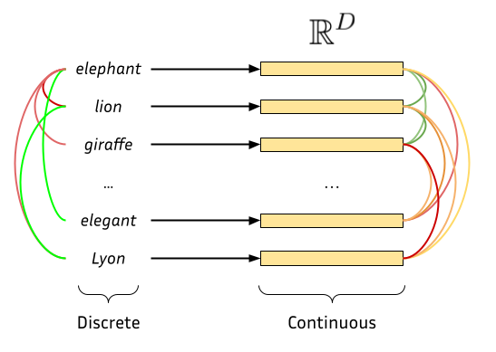
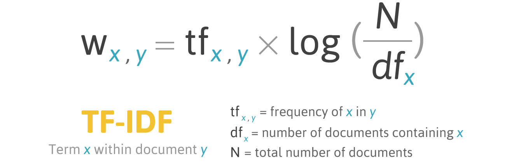
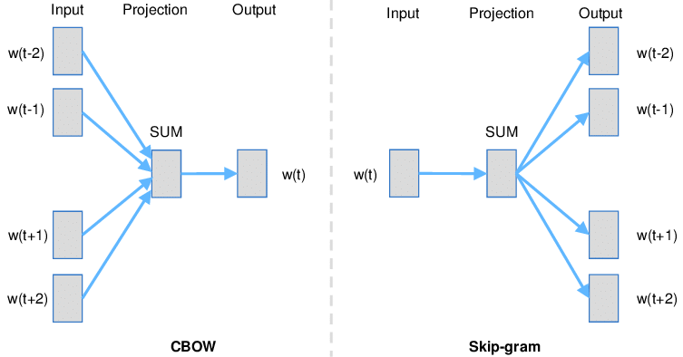
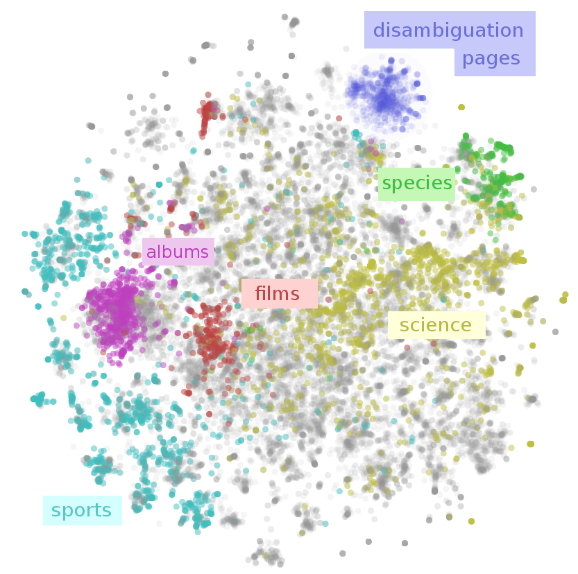
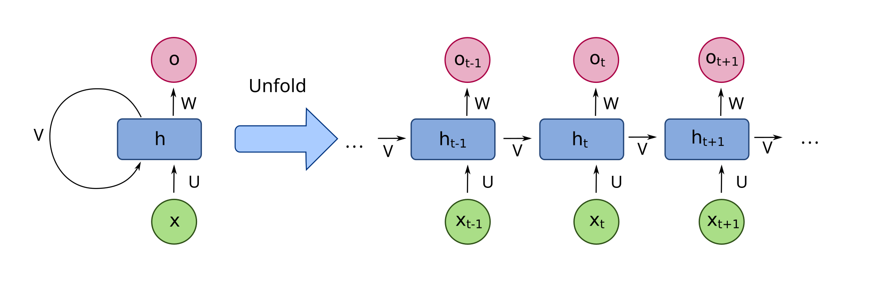
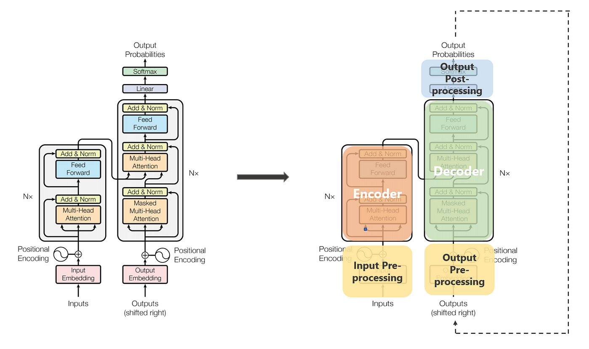
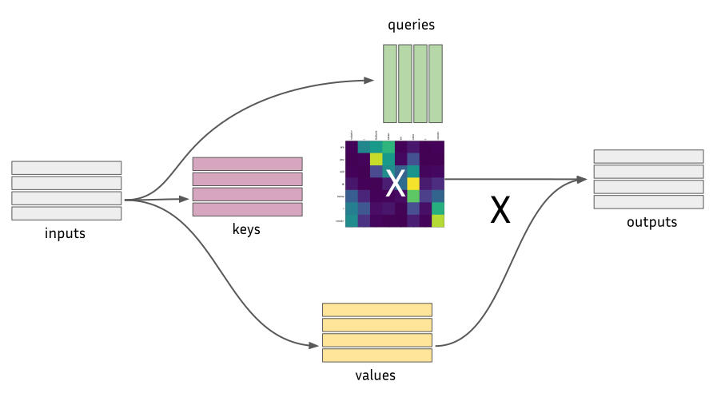

<!-- _class: title -->

# Introduction aux LLMs
## Séance 2 : Représentations vectorielles du texte

**ESGI Paris**
Célia Nouri · `celia.nouri@inria.fr`
Semestre 1, 2026–2027

---

## Au programme aujourd'hui

1. Récapitulatif
2. Représentations vectorielles des mots
3. La tokenization
4. L'architecture Transformer

---
<!-- _class: section -->

# 1. Récapitulatif

---

<!-- _class: quiz -->

## 🧩 Quiz rapide — séance 1

<br>

**1.** Quelle technique donne la forme canonique d'un mot en tenant compte de sa catégorie grammaticale ?

**2.** Pourquoi retire-t-on les *stop words* dans certaines tâches NLP ?

**3.** Qu'est-ce que la **descente de gradient** ? Décrivez la règle de mise à jour des paramètres.

**4.** Comment reconnaît-on un modèle en **surapprentissage** (*overfitting*) ?

---

## Ce que vous devez retenir

<br>

- **Stop words** → mots très fréquents sans sens discriminant (*"le"*, *"de"*, *"et"*…) ; souvent retirés en pré-traitement ⚠️ pas toujours.
- **Stemming** → troncature brute (`"courais"` → `"cour"`) ; **Lemmatisation** → forme canonique selon le contexte grammatical (`"courais"` → `"courir"`).
- **Descente de gradient** → $\theta \leftarrow \theta - \alpha \cdot \frac{\partial \mathcal{L}}{\partial \theta}$ : on se déplace à chaque étape dans la direction qui **réduit** la perte.
- **Surapprentissage** → train accuracy élevée, test accuracy basse → solutions : Dropout, early stopping, plus de données.

---

<!-- _class: section -->

# 2. Représenter les mots en vecteurs

---

## Le problème central

Les modèles mathématiques ne comprennent que des **chiffres**.

Il faut **encoder** le texte sous forme de vecteurs numériques.

<br>

Trois générations de méthodes :

| | Méthode | Sémantique |
|---|---|---|
| 1️⃣ | One-Hot / BoW / TF-IDF | ❌ aucune |
| 2️⃣ | Word2Vec, GloVe, FastText | ✅ statique |
| 3️⃣ | BERT, GPT (Transformers) | ✅✅ contextuelle |

---
## Représentations vectorielles (embeddings)

<center></center>

---

## One-Hot Encoding

Chaque mot = un vecteur de la taille du vocabulaire avec un **1** à sa position dans le vocabulaire, et des **0** partout ailleurs.

<br>

```
Vocabulaire : [chat, chien, maison, voiture, soleil]

chat    = [1, 0, 0, 0, 0]
chien   = [0, 1, 0, 0, 0]
maison  = [0, 0, 1, 0, 0]
```

<br>

---

## Bag of Words (BoW)

Pour une phrase : compter les occurrences de chaque mot du vocabulaire.

<br>

**Phrase** : *"Le chat mange le poisson"*
**Vocabulaire** : `[chat, chien, mange, poisson, maison, le]`

```
BoW = [1, 0, 1, 1, 0, 2]
```

<br>
✅ Simple, fonctionne pour la classification de documents

**Problèmes** :
- Vecteurs immenses (taille du vocabulaire ≥ 50 000)
- Aucune relation entre mots : `chat` et `chien` sont aussi différents que `chat` et `voiture`
- Très creux (*sparse*) → inefficace en mémoire
- L'ordre des mots est perdu :
*"Le chat mange le poisson"* = *"Le poisson mange le chat"* 

---

## TF-IDF

Amélioration de BoW : pondérer les mots par leur **rareté** dans le corpus.

$$\text{TF-IDF}(t, d) = \underbrace{\text{TF}(t,d)}_{\text{fréq. dans le doc}} \times \underbrace{\log\!\left(\frac{N}{\text{df}(t)}\right)}_{\text{rareté globale}}$$

<br>

- **TF** : fréquence du terme $t$ dans le document $d$
- **df** : nombre de documents contenant $t$
- **N** : nombre total de documents

<br>

*"le"*, *"de"* apparaissent partout → IDF faible → peu d'importance
*"transformer"*, *"tokenisation"* → IDF élevé → très informatifs

---

## TF-IDF

<center></center>

---

## Word2Vec (2013)

**Mikolov et al., Google, 2013** (probablement le papier en TAL le plus influent avant les Transformers).

<br>

**Idée clé** (Firth, 1957) :
> *"A word is known by the company it keeps."*

Le sens d'un mot peut être inféré en regardant les mots qui l'**entourent**.

<br>

Word2Vec entraîne un petit réseau sur une tâche simple :
- **Skip-gram** : étant donné un mot central, prédire les mots du contexte
- **CBOW** : étant donné le contexte, prédire le mot central

---
## Word2Vec : Comment ça marche ?

Apprend les représentations vectorielles des mots **sans supervision**.
<br>
<center></center>

---
## Word2Vec : Comment ça marche ?

**Skip-gram** sur la phrase *"Le [chat] dort sur le tapis"* :

<br>

```
Mot central : "chat"
          ↓
Prédire : "Le", "dort", "sur", "le"
```

<br>

Le réseau apprend des **vecteurs denses** (100–300 dimensions) pour chaque mot.

Cohérence sémantique : deux mots qui apparaissent dans des **contextes similaires** auront des vecteurs proches.

---

## Word2Vec : L'arithmétique des mots

```
vecteur("roi") - vecteur("homme") + vecteur("femme")
    ≈ vecteur("reine")
```

<br>

Certaines directions dans l'espace vectoriel ont un **sens** :
- Direction **genre** : roi → reine, acteur → actrice
- Direction **capitale** : France → Paris, Allemagne → Berlin
- Direction **pluriel** : chat → chats, chien → chiens

<br>

Conséquence statistique de l'entraînement sur des milliards de phrases.


---

## FastText (2016)

**Joulin et al., Facebook AI Research, 2016.**

<br>

**Problème commun à Word2Vec** : un mot inconnu ou rare → pas de vecteur.

<br>

**Idée** : représenter chaque mot comme une **somme de vecteurs de n-grammes de caractères**.

```
"where"  →  <where>
n-grammes (n=3) :  <wh  whe  her  ere  re>  +  <where>

vecteur("where") = Σ vecteurs des n-grammes
```

<br>

- **Mot hors-vocabulaire** → décomposé en n-grammes connus → vecteur approché
- **Formes fléchies** (*"courions"*, *"couraient"*) → partagent des n-grammes → vecteurs proches
- **Entraînement** : identique à Word2Vec (skip-gram), mais sur les n-grammes

---

## Espace latent (vectoriel)

<br>
<center></center>


---

<!-- _class: quiz -->

## 🧩 Quiz 3 

<br>

Avec des embeddings Word2Vec bien entraînés, que devrait-on obtenir pour :

<br>

$$\text{vecteur("Paris")} - \text{vecteur("France")} + \text{vecteur("Allemagne")} \approx \, ?$$

<br>


---

<!-- _class: quiz -->

## 🧩 Quiz 3 : Réponse

**Réponse : "Berlin"**

<br>

La relation **capitale ↔ pays** est encodée comme une direction dans l'espace vectoriel.

```
Paris   - France   = vecteur("est la capitale de")
Berlin  - Allemagne = vecteur("est la capitale de")
```

<br>

> **Limite critique de Word2Vec** : les embeddings sont **statiques** : un seul vecteur par mot.
> Le mot *"batterie"* a le **même vecteur** qu'il s'agisse de l'instrument de musique ou de la pile électrique. 
> → C'est ce que les Transformers vont résoudre.

---

## Recap méthodes d'embeddings statiques

<br>

| Modèle | Auteurs | Particularité |
|---|---|---|
| **Word2Vec** | Mikolov et al. (2013) | Skip-gram / CBOW |
| **FastText** | Joulin et al. (2016) | Sous-mots → gère mots rares |

<br>

FastText est particulièrement robuste sur les **langues morphologiquement riches** (allemand, finnois, arabe…) et les mots hors-vocabulaire (néologismes).

---

<!-- _class: section -->

# 2. Tokenization

---


## Trois stratégies naïves

Les ordinateurs (et les LLMs) ne traitent pas le texte directement —-> il faut d'abord convertir le texte en une **séquence de vecteurs**.
Un **token** = l'unité de base que le modèle traite, peut-être un mot, un caractère ou un sous-mot. 

<br>

| Stratégie | Exemple | Problème |
|---|---|---|
| **Par mot** | `["chat", "chats"]` → IDs différents | Mots rares, formes fléchies, OOV |
| **Par caractère** | `["c","h","a","t"]` | Séquences très longues, peu de sémantique |
| **Par sous-mot** | `["chat", "##s"]` | ✅ Bon compromis |

<br>

Les LLMs modernes utilisent tous une approche **sous-mot** apprise depuis les données.


---

## Entraîner le tokenizer

<br>

- Découpage au niveau **sous-mot** (ni mot entier, ni caractère isolé)
- **Vocabulaire fixe**, appris une fois pour toutes
- **Entraîné** sur un grand échantillon de texte, avant même le pré-entraînement du modèle
- Utilisé ensuite en mode **inférence**, comme étape de **pré-traitement** (jamais ré-entraîné avec le modèle)

<br>

Les trois algorithmes principaux pour l'entraîner : **BPE**, **WordPiece**, **Unigram**.

---

## Granularité

<br>

<center></center>

---

## Granularité : un compromis

→ Compromis entre **séquences courtes** (peu de tokens) et **taille de vocabulaire raisonnable**.

<br>

<ins>Fertilité</ins> — pour un texte $S$ donné, avec un tokenizer donné :

$$
\text{fertilité}(S) = \frac{\#\text{ tokens}}{\#\text{ mots}}
$$

<br>

La fertilité elle dépend du tokenizer et **texte auquel on l'applique** — même tokenizer, fertilité différente selon la langue ou le domaine.

<br>

- À vocabulaire égal, plus une langue est morphologiquement riche et/ou mal représentée à l'entraînement, plus sa fertilité sera élevée
- Fertilité élevée → séquences plus longues → coût d'inférence plus élevé, contexte rempli plus vite

---

## BPE — Byte-Pair Encoding

**Sennrich et al., 2016** — algorithme le plus répandu (GPT, LLaMA, Mistral…).

<br>

**Entraînement** :

```
1. Partir du vocabulaire de caractères (ou bytes)
2. Compter toutes les paires adjacentes dans le corpus
3. Fusionner la paire la plus fréquente → nouveau token
4. Répéter jusqu'à atteindre la taille de vocabulaire cible
```

<br>

On obtient une liste ordonnée de **règles de fusion** (*merge rules*), appliquées dans l'ordre à l'inférence.

---

## BPE — Exemple pas à pas (1/2)

Encodons `"aaabdaaabac"` :

<br>

```
Paires observées : {aa, ab, bd, da, ba, ac}
Occurrences      : {aa: 4, ab: 2, bd: 1, da: 1, ba: 1, ac: 1}
→ règle 1 : aa → X       "aaabdaaabac" devient "XabdXabac"
```

<br>

```
Paires observées : {Xa, ab, bd, dX, ba, ac}
Occurrences      : {Xa: 2, ab: 2, bd: 1, dX: 1, ba: 1, ac: 1}
→ règle 2 : ab → Y       "XabdXabac" devient "XYdXYac"
```

On recommence : compter les paires, fusionner la plus fréquente, répéter.

---

## BPE — Exemple pas à pas (2/2)

```
Paires observées : {XY, Yd, dX, Ya, ac}
Occurrences      : {XY: 2, Yd: 1, dX: 1, Ya: 1, ac: 1}
→ règle 3 : XY → Z       "XYdXYac" devient "ZdZac"

Paires observées : {Zd, dZ, Za, ac}  → toutes uniques → FIN
```

<br>

**Résultat** : `"aaabdaaabac"` → `"ZdZac"`, avec les règles de fusion :
`1) aa→X   2) ab→Y   3) XY→Z`

<br>

**Décodage** : appliquer les règles dans l'ordre **inverse**.

---

## WordPiece

Algorithme utilisé par **BERT, DistilBERT, ELECTRA**.

<br>

**Différence avec BPE** : au lieu de fusionner la paire *la plus fréquente*, on fusionne celle qui **maximise la vraisemblance** du corpus :

$$\text{score}(A, B) = \frac{P(AB)}{P(A) \cdot P(B)}$$

On fusionne $A$ et $B$ si les voir ensemble est plus probable que les voir séparément.

<br>

**Notation** : les sous-mots de continuation sont préfixés par `##`

```
"playing"  →  ["play", "##ing"]
"tokenize" →  ["token", "##ize"]
```

---

## Comparatif des tokenizers

<br>

| Modèle | Tokenizer | Taille vocab | Paramètres |
|---|---|---|---|
| **GPT-2** (2019) | Byte-level BPE (`gpt2`) | 50 257 | 124M – 1,5 Md |
| **GPT-3** (2020) | Byte-level BPE (`p50k_base`) | 50 281 | 125M – 175 Md |
| **GPT-4** (2023) | Byte-level BPE (`cl100k_base`) | ~100 000 | non communiqué* |
| **GPT-5** (2025) | Byte-level BPE (`o200k_base` ou successeur) | ~200 000 | non communiqué* |
| **BERT** | WordPiece | 30 522 | 110M – 340M |
| **LLaMA 1/2** | SentencePiece (BPE) | 32 000 | 7 Md – 70 Md |
| **LLaMA 3** | tiktoken (BPE) | 128 256 | 8 Md – 405 Md |
| **Mistral** | SentencePiece (BPE) | 32 000 | 7 Md |

---

## Effets pratiques de la tokenization

<br>

**Biais multilingue** : pour un même tokenizer, la **fertilité** (tokens/mot, cf. slide "Granularité") varie fortement selon la langue — un token en anglais ≈ 1 mot ; en arabe ou en thaï ≈ 3–5 tokens pour la même information → coût plus élevé, fenêtre de contexte plus vite remplie.

<br>

**Tokens spéciaux** : chaque modèle définit ses propres marqueurs.
```
[BOS] [EOS] [PAD] [UNK]          ← BERT / LLaMA
<|endoftext|>  <|im_start|>      ← GPT / ChatML
<s>  </s>  [INST]  [/INST]       ← LLaMA 2 chat
```

<br>

**Le tokenizer fait partie du modèle** : changer de tokenizer = réentraîner depuis zéro.

Essaye plusieurs tokenizers : [The Tokenizer Playground](https://huggingface.co/spaces/Xenova/the-tokenizer-playground)


---

<!-- _class: quiz -->

## 🧩 Quiz — Tokenization

<br>

**1.** Quelle est la différence entre BPE et WordPiece ?

**2.** Un modèle avec un vocabulaire de 128k tokens traite-t-il les textes multilingues mieux ou moins bien qu'un modèle avec 32k tokens ? Pourquoi ?

---

<!-- _class: quiz -->

## 🧩 Quiz — Réponses

**1.** BPE fusionne la paire *la plus fréquente* ; WordPiece fusionne celle qui maximise la vraisemblance $P(AB) / (P(A) \cdot P(B))$.

**2.** Mieux (en principe) — un grand vocabulaire alloue plus de tokens aux langues non-latines, réduisant le nombre de tokens par phrase et améliorant la représentation. Mais cela dépend du jeu de données d'entraînement du tokenizer.


---

<!-- _class: section -->

# 3. Architecture (Transformers)

---

## Réseaux Récurrents (RNNs)

Avant les Transformers (2017), les RNNs dominaient le NLP.

<br>

**Principe** : traiter les tokens **un par un**, en maintenant un **état caché** $h_t$.

```
x₁ → [RNN] → h₁
x₂ → [RNN] → h₂    (h₁ alimente h₂)
x₃ → [RNN] → h₃    (h₂ alimente h₃)
 ⋮
```

<br>

Intuitif : on lit la phrase mot à mot, la compréhension s'accumule.

---

## Réseaux Récurrents (RNNs)
<center></center>

---

## Limitations des Réseaux Récurrents (RNNs)

- Récurrence : calculs pour le token n+1 dépend du calcul pour le token n. Architecture intrinsèquement séquentielle sans parallélisation possible. 
- "Vanishing gradient" : Sur de longues séquences, les gradients se multiplient à chaque pas. Si chaque terme < 1 → le gradient devient exponentiellement **petit**.Les premiers tokens n'apprennent plus rien.


**Solutions partielles** :
- **LSTM** (Hochreiter & Schmidhuber, 1997) : portes de mémoire
- **GRU** (Cho et al., 2014) : version simplifiée du LSTM
- Limitation persistante : traitement **séquentiel**, pas de parallélisation

---

<!-- _class: section -->

## Le Transformer

"Attention is All You Need", Vaswani et al., 2017

L'idée radicale: **Se débarrasser de la récurrence.**

<br>

Au lieu de traiter les tokens un par un, permettre à **chaque token de regarder directement tous les autres** en même temps.

<br>

Avantages immédiats :
- **Parallélisation** totale → entraînement massivement accéléré sur GPU
- **Dépendances longue distance** capturées sans dégradation
- **Scalabilité** : plus de paramètres = meilleur modèle (jusqu'à un certain point)

---

## L'architecture transformer

<center></center>

---

## Le mécanisme d'Attention

**Intuition** : pour comprendre *"il"* dans *"Le chat s'est couché. Il ronronne."*, le modèle doit faire attention à *"chat"* quelques tokens plus tôt.

Le mécanisme d'attention permet à un modèle de langage de pondérer l'importance relative de chaque mot par rapport aux autres. Concrètement, pour chaque mot, le modèle calcule un score de pertinence avec tous les autres mots, ce qui lui permet de "focaliser" son interprétation sur les parties les plus utiles du contexte.

<br>

---

## Le mécanisme d'Attention

Chaque token produit **3 vecteurs** :

| Vecteur | Rôle |
|---|---|
| **Query (Q)** | "Qu'est-ce que je cherche ?" |
| **Key (K)** | "Qu'est-ce que je représente ?" |
| **Value (V)** | "Quelle information j'apporte ?" |

<br>

**Analogie** : Imagine une bibliothèque : Tu arrives avec une requête (Query) : "Je cherche un livre sur les réseaux de neurones". Chaque livre a une étiquette au dos (Key) : "Machine Learning", "Cuisine", "Histoire"... Le contenu du livre (Value) : c'est ce que tu liras vraiment si tu le choisis.
<br>
En pratique les Q, K, V pour chaque tokens sont des vecteurs entraînés pour que les bonnes paires se ressemblent. C'est le modèle qui apprend ce que "chercher" et "proposer" veulent dire.

---

## Attention : Le calcul

**Score d'attention** entre le token $i$ et le token $j$ :

$$\text{score}(i,j) = \text{softmax}\!\left(\frac{Q_i \cdot K_j}{\sqrt{d_k}}\right)$$

**Sortie** pour le token $i$ = somme pondérée des valeurs :

$$\text{output}_i = \sum_j \text{score}(i,j) \cdot V_j$$

<br>

La division par $\sqrt{d_k}$ évite que les produits scalaires deviennent trop grands et saturent le softmax.

---

### Self-Attention (Auto-attention)
Chaque mot d'une séquence calcule **son** attention sur tous les autres mots de cette **même séquence** pour enrichir sa représentation en tenant compte du contexte.

<center></center>

---

## Self-Attention : Pourquoi ça marche ?

Tous ces calculs se font **en parallèle** via des multiplications matricielles.
Le modèle ne requiert pas de supervision ou annotation manuelle. Chaque token apprend sa représentation à partir de son contexte.

```
Attention(Q, K, V) = softmax(QKᵀ / √dₖ) · V
```

<br>

**Ce que le modèle apprend** : quels tokens sont pertinents pour chaque position.

Sur la phrase *"La banque a refusé le prêt car elle manquait de fonds"* :
- Pour résoudre *"elle"* → forte attention sur *"banque"*
- Pour résoudre *"fonds"* → forte attention sur *"prêt"* et *"manquait"*

---

## Multi-Head Attention

Plutôt qu'une seule attention, le Transformer en utilise **plusieurs en parallèle**.

<br>

$$\text{MultiHead}(Q,K,V) = \text{Concat}(\text{head}_1, \ldots, \text{head}_h) \cdot W^O$$

<br>

Chaque tête peut se **spécialiser** :
- Tête 1 → relations syntaxiques (sujet-verbe)
- Tête 2 → relations sémantiques (synonymes)
- Tête 3 → coréférences (pronom → antécédent)
- …

<br>

GPT-3 : 96 têtes d'attention par couche.

---

## Encodage positionnel

**Problème** : l'attention est indépendante de l'ordre des tokens !

*"Le chat mange le poisson"* = *"Le poisson mange le chat"* sans correction.

<br>

**Solution** : ajouter un **encodage positionnel** à chaque embedding.

$$\text{embedding\_final} = \text{embedding\_mot} + \text{encodage\_position}$$

<br>

Dans le papier original : fonctions sinus/cosinus à différentes fréquences.
Les modèles modernes apprennent souvent ces positions directement (RoPE, ALiBi…).

---
## Architecture complète

<center></center>

---
## Architecture complète

```
                [ENCODEUR]                [DÉCODEUR]
           ┌──────────────────┐      ┌──────────────────────┐
           │ Multi-Head Attn  │      │ Masked MH Attention  │
           │ Feed-Forward     │  →   │ Cross-Attention      │
           │ Add & Norm       │      │ Feed-Forward         │
           │ (× N couches)    │      │ (× N couches)        │
           └──────────────────┘      └──────────────────────┘
```

<br>

- **Encodeur** → comprendre la séquence source (BERT)
- **Décodeur** → générer la séquence cible (GPT, Claude)
- **Encodeur+Décodeur** → traduction, résumé (T5, BART)

---

## Les deux familles

<br>

| | Encodeur seul | Décodeur seul |
|---|---|---|
| **Exemple** | BERT (2018, Google) | GPT-1/2/3/4 (OpenAI) |
| **Attention** | Bidirectionnelle | Causale (gauche→droite) |
| **Objectif** | Comprendre / classifier | Générer du texte |
| **Tâches** | Classification, NER, QA | Génération, dialogue |

<br>

Les LLMs actuels — **GPT-5, Claude, Llama, Mistral** — sont des **décodeurs**.

---

<!-- _class: quiz -->

## 🧩 Quiz 4

<br>

Pourquoi les Transformers s'entraînent-ils **plus vite** que les RNNs sur GPU ?

<br>

- **A)** Ils ont moins de paramètres
- **B)** L'attention calcule toutes les relations en parallèle via opérations matricielles
- **C)** Ils n'utilisent pas de rétropropagation
- **D)** Ils traitent les tokens par blocs de 10

---

## Récapitulatif

```
Texte brut
    ↓  tokenisation
Séquence de tokens
    ↓  embeddings
Vecteurs denses
    ↓  Transformer (attention)
Représentations contextuelles
```

---

## Ce que vous devez retenir

<br>

- **Word2Vec** → embeddings statiques, capturent la sémantique par le contexte
- **BPE** → apprend un vocabulaire de token les plus fréquent dans un corpus d'entrainement, ainsi que des règles d'encodage/décodage 
- **Attention** → chaque token peut regarder tous les autres en parallèle
- **Transformer** → parallélisation (encoding positionnel) + dépendances longue distance

---

<!-- _class: quiz -->

## 🧩 Quiz final : 

**Vrai/Faux :** Word2Vec résout l'ambiguïté du mot *"batterie"*.
**Vrai/Faux :** Le tokenizer BPE produit des tokenizations différentes pour les deux sens du mot *"batterie"*.
**Vrai/Faux :** L'architecture RNN résout l'ambiguïté du mot *"batterie"*.
**Vrai/Faux :** L'architecture Transformer résout l'ambiguïté du mot *"batterie"*.

---

## Ressources 

<br>

📄 **Word2Vec** : Mikolov et al. (2013); arxiv.org/abs/1301.3781
📄 **Attention is All You Need** : Vaswani et al. (2017); arxiv.org/abs/1706.03762
📄 **LSTM** : Hochreiter & Schmidhuber (1997); Neural Computation

<br>

🛠️ **spaCy** : spacy.io | **Hugging Face** : huggingface.co
📖 **CS224n** (Stanford NLP) : cours en ligne gratuit, excellent

<br>

---

## Lab : Aujourd'hui (1h)

<br>

**Partie 1** : Embeddings BoW & TF-IDF avec `scikit-learn`
Visualiser les vecteurs (PCA), comparer des documents.

**Partie 2** : Word2Vec avec `gensim`
Explorer les analogies et les voisins sémantiques.

**Partie 3** : Premier contact avec les Transformers
Charger un modèle Hugging Face, utiliser le tokenizer, obtenir des embeddings contextuels.

---

<!-- _class: title -->

# Séance 3 : 10 juillet
## Entraînement : comment construit-on un LLM ?

Tokenization · Pré-entraînement à grande échelle · Lois de Chinchilla
Instruction tuning & RLHF · Évaluation

**Lectures conseillées** :
Rafailov et al. (2023), "Direct Preference Optimization: Your Language Model is Secretly a Reward Model" : abstract + intro

`celia.nouri@inria.fr`
