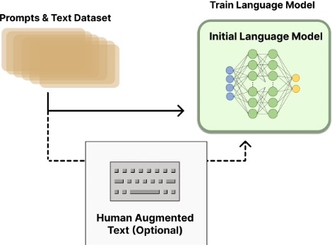
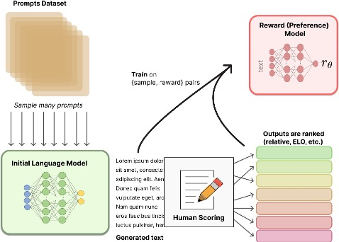
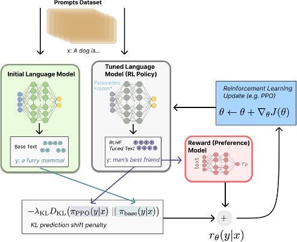
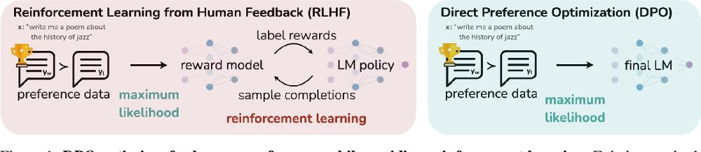

<!-- _class: title -->

# Introduction aux LLMs
## Séance 3 : Entrainement LLM

**4ème année RO DEV - ESGI Paris**
Célia Nouri · `celia.nouri@inria.fr`
Semestre 2, 2025–2026


---

# Agenda

1. Tokenization 
2. Pré-entraînement à grande échelle  
3. Lois de Chinchilla
4. Instruction tuning  
5. Alignement : RLHF et DPO 

---

<!-- _class: section -->

# 1. Tokenization

---

## Rappel : pourquoi tokeniser ?

Les ordinateurs (et les LLMs) ne traitent pas le texte directement —-> il faut d'abord convertir le texte en une **séquence de vecteurs**.


<br>

```
"J'adore le foot"
      ↓  tokenizer
  ["J'", "adore", " le", " foot"]  →  [4083, 26576, 513, 6821]
      ↓  embeddings
  [v₁, v₂, v₃, v₄]   ← vecteurs denses
```

<br>

Le tokenizer est donc la **porte d'entrée** du modèle. Son vocabulaire et ses décisions de découpage ont un impact direct sur :
- les performances du modèle
- le coût d'inférence (plus de tokens = plus cher)
- les langues bien ou mal traitées

---

## Limites de la tokenisation

<br>

De nombreux comportements étranges des LLMs — erreurs d'orthographe, de comptage, de calcul — s'expliquent en partie par des choix faits au niveau de la tokenization.

Ce n'est pas un problème résolut, il est donc important de savoir comment les algorithmes de tokenisation fonctionnent.

---

## Trois stratégies naïves

<br>

| Stratégie | Exemple | Problème |
|---|---|---|
| **Par mot** | `["chat", "chats"]` → IDs différents | Mots rares, formes fléchies, OOV |
| **Par caractère** | `["c","h","a","t"]` | Séquences très longues, peu de sémantique |
| **Par sous-mot** | `["chat", "##s"]` | ✅ Bon compromis |

<br>

Les LLMs modernes utilisent tous une approche **sous-mot** apprise depuis les données.

---

## Le tokenizer moderne : un objet entraîné

```
"i am loving it!"  →  ["i", "am", "lov", "##ing", "it", "!"]
```

<br>

- Découpage au niveau **sous-mot** (ni mot entier, ni caractère isolé)
- **Vocabulaire fixe**, appris une fois pour toutes
- **Entraîné** sur un grand échantillon de texte, avant même le pré-entraînement du modèle
- Utilisé ensuite en mode **inférence**, comme étape de **pré-traitement** (jamais ré-entraîné avec le modèle)

<br>

Les trois algorithmes principaux pour l'entraîner : **BPE**, **WordPiece**, **Unigram**.

---

## Granularité

<br>

<center></center>

---

## Granularité : un compromis

→ Compromis entre **séquences courtes** (peu de tokens) et **taille de vocabulaire raisonnable**.

<br>

<ins>Fertilité</ins> — pour une séquence de texte $S$ :

$$
\text{fertilité}(S) = \frac{\#\text{ tokens}}{\#\text{ mots}}
$$

<br>

- Fertilité proche de **1** : peu de découpage, mais vocabulaire énorme et sensible aux mots rares (OOV)
- Fertilité élevée : vocabulaire compact, mais séquences plus longues → plus cher, contexte rempli plus vite

---

## BPE — Byte-Pair Encoding

**Sennrich et al., 2016** — algorithme le plus répandu (GPT, LLaMA, Mistral…).

<br>

**Entraînement** :

```
1. Partir du vocabulaire de caractères (ou bytes)
2. Compter toutes les paires adjacentes dans le corpus
3. Fusionner la paire la plus fréquente → nouveau token
4. Répéter jusqu'à atteindre la taille de vocabulaire cible
```

<br>

On obtient une liste ordonnée de **règles de fusion** (*merge rules*), appliquées dans l'ordre à l'inférence.

---

## BPE — Exemple pas à pas (1/2)

Encodons `"aaabdaaabac"` :

<br>

```
Paires observées : {aa, ab, bd, da, ba, ac}
Occurrences      : {aa: 4, ab: 2, bd: 1, da: 1, ba: 1, ac: 1}
→ règle 1 : aa → X       "aaabdaaabac" devient "XabdXabac"
```

<br>

```
Paires observées : {Xa, ab, bd, dX, ba, ac}
Occurrences      : {Xa: 2, ab: 2, bd: 1, dX: 1, ba: 1, ac: 1}
→ règle 2 : ab → Y       "XabdXabac" devient "XYdXYac"
```

On recommence : compter les paires, fusionner la plus fréquente, répéter.

---

## BPE — Exemple pas à pas (2/2)

```
Paires observées : {XY, Yd, dX, Ya, ac}
Occurrences      : {XY: 2, Yd: 1, dX: 1, Ya: 1, ac: 1}
→ règle 3 : XY → Z       "XYdXYac" devient "ZdZac"

Paires observées : {Zd, dZ, Za, ac}  → toutes uniques → FIN
```

<br>

**Résultat** : `"aaabdaaabac"` → `"ZdZac"`, avec les règles de fusion :
`1) aa→X   2) ab→Y   3) XY→Z`

<br>

**Décodage** : appliquer les règles dans l'ordre **inverse**.

---

## Byte-level BPE

Variante utilisée par **GPT-2, GPT-3, GPT-4, RoBERTa, LLaMA** :

<br>

- Vocabulaire de base = **256 bytes** (couvre tout l'Unicode)
- **Jamais de token inconnu** : n'importe quel texte, dans n'importe quelle langue ou encodage, est représentable

<br>

**Les fusions se font sur des octets, pas sur des caractères.**

En UTF-8, un caractère peut occuper **plusieurs octets** : `"é"` = 2 octets (`0xC3 0xA9`), un emoji comme `"🤖"` = 4 octets. Le BPE classique partirait d'un vocabulaire de caractères Unicode (~150 000 possibles) — trop grand, et incomplet.

En partant des **256 octets bruts**, le vocabulaire de départ reste petit et fixe, quelle que soit la langue. L'algorithme apprend ensuite à **fusionner des octets fréquents** — parfois ceux d'un même caractère (`0xC3 0xA9` → `"é"`), parfois ceux de plusieurs caractères qui vont souvent ensemble.


---

## Byte-level BPE (exemple)

<br>

```python
# GPT-4 tokenizer (tiktoken)
"ChatGPT" → ["Chat", "G", "PT"]      # mot inconnu → décomposé en bytes connus
"你好"    → ["你", "好"]               # chinois géré nativement
"🤖"      → ["<0xF0>","<0x9F>","<0xA4>","<0x96>"]  # emoji → bytes bruts
```

---

## WordPiece

Algorithme utilisé par **BERT, DistilBERT, ELECTRA**.

<br>

**Différence avec BPE** : au lieu de fusionner la paire *la plus fréquente*, on fusionne celle qui **maximise la vraisemblance** du corpus :

$$\text{score}(A, B) = \frac{P(AB)}{P(A) \cdot P(B)}$$

On fusionne $A$ et $B$ si les voir ensemble est plus probable que les voir séparément.

<br>

**Notation** : les sous-mots de continuation sont préfixés par `##`

```
"playing"  →  ["play", "##ing"]
"tokenize" →  ["token", "##ize"]
```

---

## SentencePiece

Bibliothèque de **Kudo & Richardson (2018, Google)**, utilisée pour entraîner et appliquer le tokenizer de **LLaMA** et **Mistral**.

<br>

**Innovation clé** : fonctionne directement sur le texte brut, **sans pré-tokenisation par espace**.

```
Word-level tokenizer :  "New York"  →  ["New", "York"]
SentencePiece         :  "New York"  →  ["▁New", "▁York"]
                         (▁ = espace encodé comme caractère)
```

<br>

**Avantages** :
- Universel : pas d'hypothèse sur les espaces (chinois, japonais, thaï…)
- Déterministe et réversible : on peut toujours retrouver le texte original

---

## Comparatif des tokenizers

<br>

| Modèle | Tokenizer | Taille vocab | Paramètres |
|---|---|---|---|
| **GPT-2** (2019) | Byte-level BPE (`gpt2`) | 50 257 | 124M – 1,5 Md |
| **GPT-3** (2020) | Byte-level BPE (`p50k_base`) | 50 281 | 125M – 175 Md |
| **GPT-4** (2023) | Byte-level BPE (`cl100k_base`) | ~100 000 | non communiqué* |
| **GPT-5** (2025) | Byte-level BPE (`o200k_base` ou successeur) | ~200 000 | non communiqué* |
| **BERT** | WordPiece | 30 522 | 110M – 340M |
| **LLaMA 1/2** | SentencePiece (BPE) | 32 000 | 7 Md – 70 Md |
| **LLaMA 3** | tiktoken (BPE) | 128 256 | 8 Md – 405 Md |
| **Mistral** | SentencePiece (BPE) | 32 000 | 7 Md |


---

## Comparatif des tokenizers

<br>

> Depuis GPT-4, OpenAI ne publie plus l'architecture ni le nombre de paramètres — seule la taille du vocabulaire est connue (encodages publics via la librairie `tiktoken`).

> Les grands vocabulaires (LLaMA 3, GPT-4/5) améliorent la couverture multilingue et réduisent le nombre de tokens par phrase — la tendance est à la hausse (50k → 200k) au fil des générations.

---

## Effets pratiques de la tokenization

<br>

**Biais multilingue** : un token en anglais ≈ 1 mot ; en arabe ou en thaï ≈ 3–5 tokens pour la même information → coût plus élevé, fenêtre de contexte plus vite remplie.

<br>

**Tokens spéciaux** : chaque modèle définit ses propres marqueurs.
```
[BOS] [EOS] [PAD] [UNK]          ← BERT / LLaMA
<|endoftext|>  <|im_start|>      ← GPT / ChatML
<s>  </s>  [INST]  [/INST]       ← LLaMA 2 chat
```

<br>

**Le tokenizer fait partie du modèle** : changer de tokenizer = réentraîner depuis zéro.

---

<!-- _class: quiz -->

## 🧩 Quiz — Tokenization

<br>

**1.** Quelle est la différence entre BPE et WordPiece ?

**2.** Pourquoi le *byte-level* BPE ne produit-il jamais de token `[UNK]` ?

**3.** Un modèle avec un vocabulaire de 128k tokens traite-t-il les textes multilingues mieux ou moins bien qu'un modèle avec 32k tokens ? Pourquoi ?

---

<!-- _class: quiz -->

## 🧩 Quiz — Réponses

**1.** BPE fusionne la paire *la plus fréquente* ; WordPiece fusionne celle qui maximise la vraisemblance $P(AB) / (P(A) \cdot P(B))$.

**2.** Le vocabulaire de base contient les 256 bytes possibles → tout octet est représentable, donc tout texte est encodable sans token inconnu.

**3.** **Faux.** SentencePiece encode l'espace comme un caractère `▁`, ce qui lui permet de fonctionner sur du texte brut sans pré-tokenisation.

**3.** Mieux (en principe) — un grand vocabulaire alloue plus de tokens aux langues non-latines, réduisant le nombre de tokens par phrase et améliorant la représentation. Mais cela dépend du jeu de données d'entraînement du tokenizer.

---

<!-- _class: section -->

# 2. Pré-entraînement à grande échelle

---

## La logique des LLMs modernes

<br>

**Étape 1 — Pré-entraînement** : tâche non supervisée, immense corpus
**Étape 2 — Fine-tuning / Alignement** : adaptation au comportement souhaité


<br>

```
[Texte brut du web]            [Données annotées / préférences]
        ↓                              ↓
[Pré-entraînement]  →  [Modèle]  →  [Fine-tuning]  →  [Assistant aligné]
   (semaines/mois)    général       (heures/jours)
```

<br>

**Pourquoi cette séparation ?** Le pré-entraînement est coûteux mais ne se fait qu'une fois. Tout le reste (sections 4, 5, 6) part de ce modèle de base.

---

## Pré-entraînement : prédire le prochain token

Pour un modèle décodeur (type GPT), la tâche est :

> **Étant donné tous les tokens précédents, prédire le suivant.**

<br>

```
Input  : "Le chat est assis sur le"
Cible  : "tapis"
```

<br>

- Aucune annotation humaine nécessaire — tout texte est une donnée gratuite
- GPT-3 : ~300 milliards de tokens d'entraînement
- LLaMA 3 : ~15 000 milliards de tokens

---

## Ce que le modèle apprend implicitement

En apprenant à prédire la suite, le modèle doit **modéliser** :

<br>

- La **grammaire** (pour prédire la bonne forme)
- Les **faits du monde** (Paris est la capitale de la France)
- Le **raisonnement** (si A alors B)
- Le **style** et le **ton**
- Les **relations entre concepts**

<br>

Les LLMs ne "savent" rien au sens factuel — ils modélisent ce qui est **probable**, pas ce qui est vrai.

---

## D'où viennent les données ?

<br>

| Corpus | Contenu | Taille approx. |
|---|---|---|
| **Common Crawl** | Archive brute du web, depuis 2008 | plusieurs Po |
| **C4** (Google) | Common Crawl filtré et nettoyé | ~750 Go |
| **The Pile** (EleutherAI, 2020) | 22 sous-corpus : livres, code, PubMed, ArXiv… | 825 Go |
| **FineWeb** (Hugging Face, 2024) | Common Crawl filtré, déduplication poussée | 15 000 Md tokens |
| **Wikipedia, livres, code (GitHub)** | Sources denses en connaissance / structure | variable |

<br>

En pratique, un LLM récent mélange **web généraliste + code + livres + données multilingues**, avec des proportions choisies à la main (*data mixture*).

---

## Nettoyer les données : pas si simple

Le web brut est plein de **doublons, spam, texte de mauvaise qualité, contenus toxiques**.

<br>

**Pipeline typique de nettoyage** :
```
Filtrage de langue → Déduplication → Filtrage qualité (heuristiques + classifieur)
→ Suppression des PII (données personnelles) → Filtrage contenu toxique/NSFW → Mélange des sources
```

<br>

**Deux risques concrets** :
- **Contamination** : si des benchmarks d'évaluation fuitent dans les données d'entraînement, le modèle les "a déjà vus" → scores gonflés (on en parlera plus tard)
- **Droit d'auteur** : procès *New York Times vs OpenAI* (2023) — utiliser des textes protégés pour l'entraînement est-il légal ? Question encore non tranchée juridiquement.


---

<!-- _class: quiz -->

## 🧩 Quiz — Pré-entraînement

<br>

**1.** Pourquoi le pré-entraînement ne nécessite-t-il aucune annotation humaine ?

**2.** Citez un risque concret lié à des données d'entraînement mal nettoyées.

---

<!-- _class: quiz -->

## 🧩 Quiz — Réponses

**1.** La cible (le token suivant) est déjà présente dans le texte lui-même — tout texte brut fournit ses propres paires (input, cible) gratuitement.

**2.** Contenus toxiques (racisme, sexisme) appris par le modèle, contamination des benchmarks (scores gonflés artificiellement) ou violation de droits d'auteur (ex. procès NYT vs OpenAI).


---

<!-- _class: section -->

# 3. Lois de Chinchilla

---

## Une question simple, mais coûteuse

Avec un budget de calcul **fixé** (un nombre de GPU pendant un temps donné), faut-il :

<br>

- Entraîner un **très grand modèle** sur **peu de données** ?
- Ou un **modèle plus petit** sur **beaucoup plus de données** ?

<br>

Se tromper coûte des millions de dollars de calcul gaspillé. Deux papiers y répondent.

---

## Kaplan et al. (2020) — les premières lois d'échelle

**"Scaling Laws for Neural Language Models"**, OpenAI.

<br>

**Constat** : la performance suit une loi de puissance prévisible selon la taille du modèle, la quantité de données et le calcul utilisé.

<br>

**Conclusion (de l'époque)** : à budget de calcul fixé, il vaut mieux **prioriser la taille du modèle** et ne pas trop se soucier de la quantité de données.

→ Cette recommandation a motivé des modèles comme **GPT-3 (175B)** ou **Gopher (280B)**.

---

## Hoffmann et al. (2022) — Chinchilla

**"Training Compute-Optimal Large Language Models"**, DeepMind.

<br>

**Résultat surprenant** : la méthodologie de Kaplan et al. sous-estimait l'importance des données. Pour un budget de calcul fixé, **taille du modèle et nombre de tokens doivent croître au même rythme**.

<br>

**Règle empirique** : environ **20 tokens d'entraînement par paramètre** pour un usage optimal du calcul.

<br>

Conclusion : la plupart des grands modèles de l'époque (dont Gopher) étaient **trop gros et sous-entraînés**.

---

## La preuve par l'exemple

<br>

| Modèle | Paramètres | Tokens d'entraînement | Performance |
|---|---|---|---|
| **Gopher** (DeepMind) | 280 milliards | 300 milliards | référence |
| **Chinchilla** (DeepMind) | 70 milliards | 1 400 milliards | **> Gopher**, à calcul égal |

<br>

Chinchilla est **4× plus petit** que Gopher, entraîné sur **~4.7× plus de tokens**, pour un coût de calcul **identique** — et surpasse Gopher sur la quasi-totalité des benchmarks.

<br>

> Conséquence directe : de nombreux modèles étaient en réalité **sous-entraînés**, pas trop petits.

---

## Une nuance importante : le coût d'inférence

Les lois de Chinchilla optimisent le coût de **l'entraînement**. Mais un modèle déployé à grande échelle est **utilisé (inféré) des milliards de fois** après son entraînement.

<br>

**LLaMA (Meta, 2023)** a fait un choix différent : entraîner des modèles **plus petits que l'optimum Chinchilla**, mais sur **encore plus de tokens** que ce que Chinchilla recommanderait — pour réduire durablement le coût d'inférence, quitte à dépenser plus de calcul à l'entraînement.

<br>

> "Compute-optimal" (moins cher à entraîner) ≠ "inference-optimal" (moins cher à faire tourner ensuite).

---

<!-- _class: quiz -->

## 🧩 Quiz — Chinchilla

<br>

**1.** Quelle est la principale différence entre les conclusions de Kaplan et al. (2020) et Hoffmann et al. (2022) ?

**2.** LLaMA a choisi d'entraîner des modèles plus petits que l'optimum Chinchilla, mais sur beaucoup plus de tokens que recommandé, quitte à dépenser plus de calcul à l'entraînement. Quel intérêt à long terme justifie ce choix ?

---

<!-- _class: quiz -->

## 🧩 Quiz — Réponses

**1.** Kaplan et al. priorisaient la taille du modèle ; Hoffmann et al. montrent que taille du modèle et quantité de données doivent croître **ensemble** (~20 tokens/paramètre).


**2.** Pour réduire le **coût d'inférence** à long terme : un modèle plus petit et sur-entraîné coûte plus cher à produire mais beaucoup moins cher à faire tourner en production, à qualité égale.

---

<!-- _class: section -->

# 4. Instruction tuning

---

## Le problème du modèle brut

Un modèle juste pré-entraîné sait **continuer du texte**, pas **suivre des instructions**.

<br>

```
Prompt : "Explique-moi la photosynthèse."

Modèle pré-entraîné brut :
  "Explique-moi la mitose cellulaire.
   Explique-moi la respiration cellulaire.
   Explique-moi..."          ← continue le style d'une liste de questions

Modèle instruction-tuned :
  "La photosynthèse est le processus par lequel les plantes..."
```

<br>

Le modèle de base imite la distribution du **web** — qui contient autant de questions que de réponses.

---

## Supervised Fine-Tuning (SFT)

**Principe** : ré-entraîner (brièvement) le modèle sur des paires **(instruction, réponse souhaitée)**, rédigées ou validées par des humains.

<br>

```
Instruction : "Résume ce texte en 3 phrases : [...]"
Réponse     : "Le texte explique que... En résumé..."
```

<br>

- Même fonction de perte que le pré-entraînement (prédiction du prochain token)
- Mais calculée **uniquement sur les tokens de la réponse**, pas sur l'instruction
- Beaucoup moins de données que le pré-entraînement : quelques milliers à quelques millions d'exemples, contre des milliards de documents

---

## Supervised Fine-Tuning (SFT)

<br>

On peut aussi caster des tâches NLP "classiques" (classification de sentiment, de toxicité, NLI, résumé, traduction…) en paires texte→texte, et les mélanger aux instructions.

```
Tâche classique   : classifier("Ce film est nul") → "négatif"
Reformulée en SFT : Instruction "Ce commentaire est-il positif ou négatif ? [...]" → Réponse "négatif"
```

---

## D'où viennent ces datasets d'instructions ?

<br>

| Dataset | Origine | Idée clé |
|---|---|---|
| **FLAN** (Google, 2021-2022) | Reformulation de tâches NLP existantes en instructions | Généralisation à des tâches jamais vues |
| **Self-Instruct** (Wang et al., 2022) | Un LLM génère **lui-même** de nouvelles instructions à partir d'exemples de départ | Réduit le besoin d'annotation humaine |
| **Alpaca** (Stanford, 2023) | 52k instructions générées via Self-Instruct (avec GPT-3), utilisées pour fine-tuner LLaMA | Modèle instruction-tuned pour ~600$ de coût API |
| **Dolly / OpenAssistant** | Instructions rédigées par des humains (employés, volontaires) | Données 100% humaines, ouvertes |


---

<!-- _class: quiz -->

## 🧩 Quiz — Instruction tuning

<br>

**1.** Un modèle pré-entraîné brut répond mal à *"Explique-moi la photosynthèse"*. Pourquoi ?

**2.** Sur quels tokens calcule-t-on la perte pendant le SFT : l'instruction, la réponse, ou les deux ?


---

<!-- _class: quiz -->

## 🧩 Quiz — Réponses

**1.** Il n'a appris qu'à **continuer du texte** de la même manière que sur le web ; rien ne le pousse à *répondre* plutôt qu'à *continuer la liste de questions*.

**2.** Uniquement sur les tokens de la **réponse** — l'instruction sert de contexte, pas de cible à prédire.

---

<!-- _class: section -->

# 5. Alignement : RLHF et DPO

---

## Pourquoi ne pas s'arrêter au SFT ?

Même après l'instruction tuning, un modèle peut être :

<br>

- **Peu utile** : réponses vagues, trop courtes ou trop longues
- **Non sûr** : contenu dangereux, biaisé, ou toxique
- **Mal calibré** sur les préférences humaines fines (ton, style, niveau de détail)

<br>

Objectif d'**alignement** (Anthropic, *HHH*) : un modèle **Helpful, Honest, Harmless**.

<br>

> Le SFT apprend "un exemple correct parmi d'autres". L'alignement apprend **une préférence relative** : "cette réponse est meilleure que celle-là."

---

## RLHF — Reinforcement Learning from Human Feedback

**Ouyang et al. (2022, OpenAI)** — pipeline utilisé pour **InstructGPT**, ancêtre direct de ChatGPT.

<br>

```
Étape 1 — SFT             : fine-tuning supervisé (déjà vu)
Étape 2 — Reward Model    : entraîner un modèle à noter des réponses
Étape 3 — RL (PPO, proximal policy optimisation)        : optimiser le LLM pour maximiser cette note
```

---

## Étape 1 : Pre-training et SFT

1. Pré-entraînez et finetunez votre modèle sur du texte brut, avec un objectif de CLM (*Causal Language Modeling*, prédiction du prochain token).

<br>

<center></center>


---

## Étape 2 : le modèle de récompense

On ne demande **pas** à des humains de noter une réponse dans l'absolu (trop subjectif) — on leur demande de **comparer** deux réponses.

<br>

```
Prompt   : "Explique la relativité restreinte."
Réponse A: [claire, correcte]
Réponse B: [confuse, un peu fausse]

Humain   : A > B
```

<br>

Le **reward model** est entraîné sur des milliers de comparaisons de ce type, pour apprendre à **prédire un score de préférence** pour n'importe quelle réponse.

---

## Étape 2 : le modèle de récompense

2. Entraînez un second modèle de langage à classer les réponses du premier modèle, en se basant sur des préférences humaines.

<br>

<center></center>

---

## Étape 3 : optimiser avec RL (PPO)

Le LLM est ensuite ajusté pour **générer des réponses que le reward model note bien** — via l'algorithme **PPO** (Proximal Policy Optimization).

<br>

<center></center>

---

## Étape 3 : optimiser avec RL (PPO)

<br>

```
LLM génère une réponse → Reward Model la note → PPO ajuste les poids du LLM
                          pour augmenter la note future
```

<br>

**Garde-fou essentiel** : une pénalité **KL-divergence** empêche le modèle de trop s'éloigner du modèle SFT initial — sinon il apprend à "tricher" avec le reward model (*reward hacking*) au lieu de vraiment s'améliorer.

---

## Les limites du RLHF

<br>

- **Pipeline complexe** : 3 modèles à entraîner et maintenir (SFT, reward model, politique RL)
- **RL instable** : sensible aux hyperparamètres, coûteux à faire converger
- **Reward hacking** : le modèle peut exploiter des failles du reward model plutôt que réellement s'améliorer
- Nécessite de **stocker et faire tourner** le reward model en plus du LLM pendant l'entraînement

<br>

→ Motive une simplification : peut-on aligner un modèle **sans** RL ni reward model séparé ?

---

## DPO — Direct Preference Optimization

**Rafailov et al. (2023)** — *"Direct Preference Optimization: Your Language Model is Secretly a Reward Model"*

<br>

**Idée clé** : on peut montrer mathématiquement qu'un objectif RLHF (reward model + PPO) admet une solution optimale exprimable **directement** en fonction du modèle de langage lui-même.

<br>

Résultat : **pas besoin d'entraîner un reward model séparé, ni de faire du RL**. On optimise directement une perte de classification sur les paires (réponse préférée, réponse rejetée).

```
DPO : ajuster le LLM pour augmenter P(réponse préférée)
      et diminuer P(réponse rejetée) — directement, par descente de gradient
```

---

## RLHF vs DPO

<br>

<center></center>


---

## RLHF vs DPO

<br>

| | **RLHF** | **DPO** |
|---|---|---|
| **Modèles à entraîner** | SFT + Reward Model + Policy RL | SFT + un seul modèle final |
| **Algorithme** | PPO (reinforcement learning) | Descente de gradient supervisée |
| **Stabilité** | Sensible, coûteux à régler | Plus simple, plus stable |
| **Popularité (2023+)** | Standard historique (InstructGPT) | Largement adopté (Zephyr, Mixtral-Instruct, LLaMA 3…) |

<br>

DPO ne remplace pas la **collecte de préférences humaines** — seulement la façon d'optimiser le modèle à partir de ces préférences.

---

<!-- _class: quiz -->

## 🧩 Quiz — RLHF & DPO

<br>

**1.** Pourquoi demande-t-on aux humains de **comparer** deux réponses plutôt que de noter une réponse seule ?

**2.** À quoi sert la pénalité KL-divergence pendant l'étape RL du RLHF ?

**3.** Quelle est la principale simplification qu'apporte DPO par rapport au RLHF classique ?

---

<!-- _class: quiz -->

## 🧩 Quiz — Réponses

**1.** Comparer deux réponses est **beaucoup plus fiable et cohérent** entre humains que noter une réponse dans l'absolu — un jugement relatif est plus facile à faire qu'un jugement absolu.

**2.** Elle empêche le modèle de trop s'éloigner de sa version SFT initiale, ce qui évite le **reward hacking** (exploiter des failles du reward model).

**3.** DPO élimine le besoin d'un **reward model séparé** et d'un algorithme de **RL (PPO)** : l'alignement se fait par une seule perte supervisée, directement sur les paires de préférences.

---

## Récapitulatif : comment construit-on un LLM ?

<br>

```
Texte brut du web (nettoyé)
    ↓  pré-entraînement à grande échelle (loi de Chinchilla : taille ↔ données)
Modèle de base (complète du texte)
    ↓  instruction tuning (SFT)
Modèle qui suit des instructions
    ↓  alignement (RLHF ou DPO)
Assistant aligné sur les préférences humaines
    ↓  évaluation (benchmarks + humains + LLM-as-judge)
Modèle déployé
```

---

## Ressources

<br>

📄 **Scaling Laws** : Kaplan et al. (2020); arxiv.org/abs/2001.08361
📄 **Chinchilla** : Hoffmann et al. (2022); arxiv.org/abs/2203.15556
📄 **InstructGPT (RLHF)** : Ouyang et al. (2022); arxiv.org/abs/2203.02155
📄 **Self-Instruct** : Wang et al. (2022); arxiv.org/abs/2212.10560
📄 **DPO** : Rafailov et al. (2023); arxiv.org/abs/2305.18290

<br>

🛠️ **Hugging Face TRL** (SFT, DPO, PPO) : huggingface.co/docs/trl

---

## Lab : Aujourd'hui (1h-2h)

<br>

**Partie 1** : Explorer un dataset d'instructions (Alpaca / Dolly)
Observer le format (instruction, réponse), identifier des exemples ambigus ou de mauvaise qualité.

**Partie 2** : SFT léger sur un petit modèle avec `TRL` / `transformers`
Fine-tuner un modèle open-source de petite taille sur un sous-ensemble d'instructions.

**Partie 3** : Comparer avant / après
Évaluer qualitativement (et via un prompt LLM-as-judge) les réponses du modèle avant et après le SFT.


